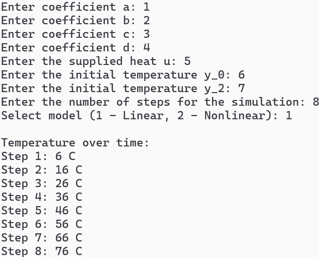
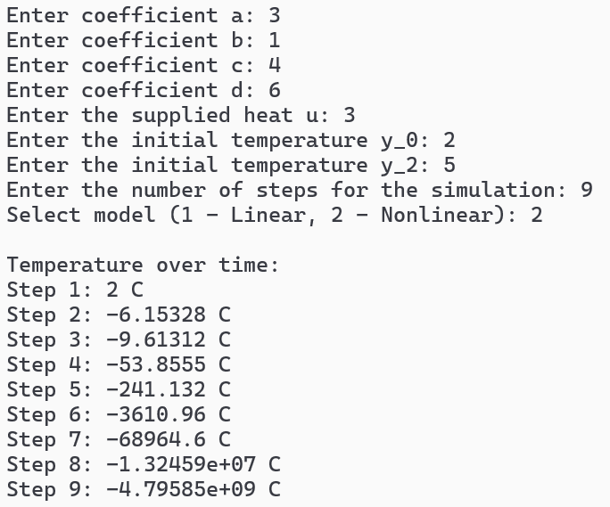

<p align="center"> Министерство образования Республики Беларусь</p>
<p align="center">Учреждение образования</p>
<p align="center">“Брестский Государственный технический университет”</p>
<p align="center">Кафедра ИИТ</p>
<br><br><br><br><br><br><br>
<p align="center">Лабораторная работа №1</p>
<p align="center">По дисциплине “Общая теория интеллектуальных систем”</p>
<p align="center">Тема: “Моделирование температуры объекта”</p>
<br><br><br><br><br>
<p align="right">Выполнил:</p>
<p align="right">Студент 2 курса</p>
<p align="right">Группы ИИ-28</p>
<p align="right">Шумский И.Н.</p>
<p align="right">Проверил:</p>
<p align="right">Иванюк Д.С.</p>
<br><br><br><br><br>
<p align="center">Брест 2025</p>

# Общее задание #
1. Написать отчет по выполненной лабораторной работе №1 в .md формате (readme.md) и с помощью запроса на внесение изменений (**pull request**) разместить его в следующем каталоге: **trunk\ii0xxyy\task_01\doc** (где **xx** - номер группы, **yy** - номер студента, например **ii02302**).
2. Исходный код написанной программы разместить в каталоге: **trunk\ii0xxyy\task_01\src**.
3. Выполнить рецензирование ([review](https://linearb.io/blog/code-review-on-github), [checklist](https://linearb.io/blog/code-review-checklist)) запросов других студентов (минимум 2-е рецензии).
4. Отразить выполнение работы в файле readme.md в соответствующей строке (например, для студента под порядковым номером 1 - https://github.com/brstu/OTIS-2023/edit/main/readme.md?#L17-L17).

## Task 1. Modeling controlled object ##
Let's get some object to be controlled. We want to control its temperature, which can be described by this differential equation:

$$\Large\frac{dy(\tau)}{d\tau}=\frac{u(\tau)}{C}+\frac{Y_0-y(\tau)}{RC} $$ (1)

where $\tau$ – time; $y(\tau)$ – input temperature; $u(\tau)$ – input warm; $Y_0$ – room temperature; $C,RC$ – some constants.

After transformation we get these linear (2) and nonlinear (3) models:

$$\Large y_{\tau+1}=ay_{\tau}+bu_{\tau}$$ (2)
$$\Large y_{\tau+1}=ay_{\tau}-by_{\tau-1}^2+cu_{\tau}+d\sin(u_{\tau-1})$$ (3)

where $\tau$ – time discrete moments ($1,2,3{\dots}n$); $a,b,c,d$ – some constants.

Task is to write program (**С++**), which simulates this object temperature.


## Код программы:
```C++
#include <iostream>
#include <memory>
#include <cmath>

// Базовый класс для моделирования
class ISimulatedModel {
public:
    virtual void simulate(double initial_value, double input, int time_steps) const = 0;
    virtual ~ISimulatedModel() = default;
};

// Линейная модель: y(t+1) = a*y(t) + b*u(t)
class LinearModel : public ISimulatedModel {
public:
    LinearModel(double coefficient_a, double coefficient_b)
        : coefficient_a_(coefficient_a), coefficient_b_(coefficient_b) {
    }

    ~LinearModel() override = default;

    void simulate(double initial_value, double input, int time_steps) const override {
        double current_value = initial_value;

        for (int step = 0; step <= time_steps; step++) {
            std::cout << step << " " << current_value << std::endl;
            current_value = coefficient_a_ * current_value + coefficient_b_ * input;
        }
    }

private:
    const double coefficient_a_;
    const double coefficient_b_;
};

// Нелинейная модель: y(t+1) = a*y(t) - b*y(t-1)² + c*u(t) + d*sin(u(t-1))
class NonLinearModel : public ISimulatedModel {
public:
    NonLinearModel(double coefficient_a, double coefficient_b,
        double coefficient_c, double coefficient_d)
        : coefficient_a_(coefficient_a), coefficient_b_(coefficient_b),
        coefficient_c_(coefficient_c), coefficient_d_(coefficient_d) {
    }

    ~NonLinearModel() override = default;

    void simulate(double initial_value, double input, int time_steps) const override {
        double current_value = initial_value;
        double previous_value = initial_value;
        double previous_input = input;
        double current_input = input;

        for (int step = 0; step <= time_steps; step++) {
            std::cout << step << " " << current_value << std::endl;

            double next_value = coefficient_a_ * current_value
                - coefficient_b_ * previous_value * previous_value
                + coefficient_c_ * current_input
                + coefficient_d_ * std::sin(previous_input);

            previous_value = current_value;
            previous_input = current_input;
            current_input += input_step_;
            current_value = next_value;
        }
    }

private:
    const double coefficient_a_;
    const double coefficient_b_;
    const double coefficient_c_;
    const double coefficient_d_;
    const double input_step_ = 0.5;
};

// Фабрика для создания моделей
class IModelFactory {
public:
    virtual std::unique_ptr<ISimulatedModel> createModel() const = 0;
    virtual ~IModelFactory() = default;
};

// Фабрика линейных моделей
class LinearModelFactory : public IModelFactory {
public:
    ~LinearModelFactory() override = default;

    std::unique_ptr<ISimulatedModel> createModel() const override {
        return std::make_unique<LinearModel>(linear_coefficient_a, linear_coefficient_b);
    }

private:
    const double linear_coefficient_a = 0.5;
    const double linear_coefficient_b = 0.5;
};

// Фабрика нелинейных моделей
class NonLinearModelFactory : public IModelFactory {
public:
    ~NonLinearModelFactory() override = default;

    std::unique_ptr<ISimulatedModel> createModel() const override {
        return std::make_unique<NonLinearModel>(nonlinear_coefficient_a, nonlinear_coefficient_b,
            nonlinear_coefficient_c, nonlinear_coefficient_d);
    }

private:
    const double nonlinear_coefficient_a = 0.5;
    const double nonlinear_coefficient_b = 0.5;
    const double nonlinear_coefficient_c = 0.5;
    const double nonlinear_coefficient_d = 0.5;
};

// Основная программа
int main() {
    const double initial_condition = 0.0;
    const double input_signal = 1.0;
    const int simulation_time = 25;

    // Тестирование линейной модели
    std::cout << "Linear Model Simulation:" << std::endl;
    auto linear_factory = std::make_unique<LinearModelFactory>();
    auto linear_model = linear_factory->createModel();
    linear_model->simulate(initial_condition, input_signal, simulation_time);
    std::cout << std::endl;

    // Тестирование нелинейной модели
    std::cout << "Nonlinear Model Simulation:" << std::endl;
    auto nonlinear_factory = std::make_unique<NonLinearModelFactory>();
    auto nonlinear_model = nonlinear_factory->createModel();
    nonlinear_model->simulate(initial_condition, input_signal, simulation_time);
    std::cout << std::endl;

    return 0;
}```

## Результат программы:
Вывод линейной симуляции:
<br>

<br>
Вывод нелинейной симуляции:
<br>

