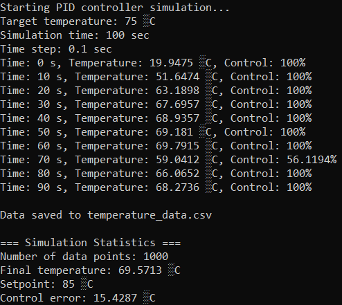
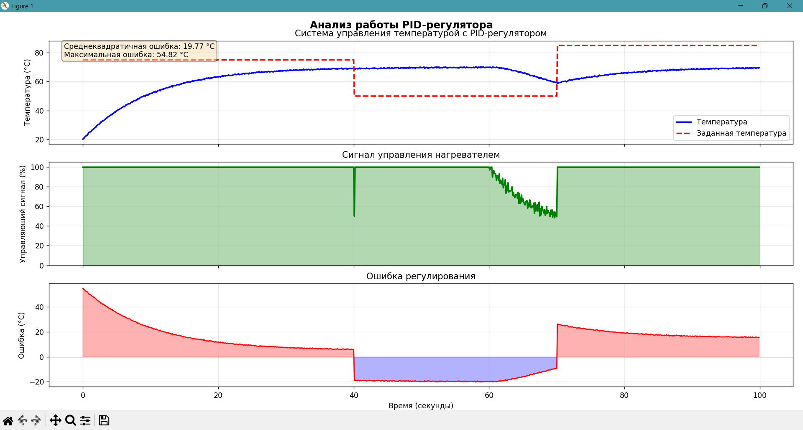
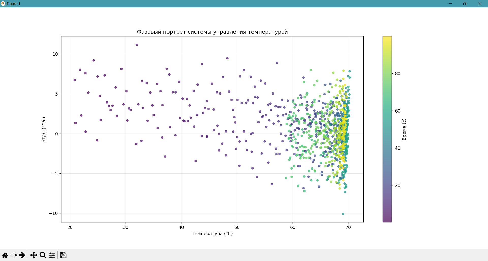

<p align="center">Министерство образования Республики Беларусь</p>
<p align="center">Учреждение образования</p>
<p align="center">“Брестский Государственный технический университет”</p>
<p align="center">Кафедра ИИТ</p>
<br><br><br><br><br><br><br>
<p align="center">Лабораторная работа №3</p>
<p align="center">По дисциплине “Общая теория интеллектуальных систем”</p>
<p align="center">Тема: “Моделирование системы с ПИД-регулятором.”</p>
<br><br><br><br><br>
<p align="right">Выполнил:</p>
<p align="right">Студент 2 курса</p>
<p align="right">Группы ИИ-27</p>
<p align="right">Куцко Р.Р.</p>
<p align="right">Проверил:</p>
<p align="right">Дворанинович Д.А.</p>
<br><br><br><br><br>
<p align="center">Брест 2025</p>

1. Написать отчет по выполненной лабораторной работе №3 в .md формате (*readme.md*) и разместить его в следующем каталоге: **trunk\ii0xxyy\task_03\doc**.
2. Исходный код написанной программы разместить в каталоге: **trunk\ii0xxyy\task_03\src**.
3. Отразить выполнение работы в файле readme.md в соответствующей строке (например, для студента под порядковым номером 1 - https://github.com/brstu/OTIS-2025/edit/main/readme.md?#L17-L17).
4. Документировать исходный код программы с помощью комментариев в стиле **Doxygen**. Полученную документацию разместить в каталоге: **trunk\ii0xxyy\task_03\doc\html**. Настроить `GitHub Pages` для автоматической публикации документации из этого каталога.
5. Разработанная программа также должна быть покрыта модульными тестами, написанными с использованием **Google Test**. Тесты разместить в каталоге: **trunk\ii0xxyy\task_03\test**.

**Лабораторная работа №3.**

**ПИД-регуляторы**

Структурная схема системы автоматического управления с обратной связью показана на рис.1.


Здесь w(t) - алгоритм функционирования системы; u(t) - управляющее воздействие; z(t) - внешние возмущающие воздействия, влияние которых нужно свести к минимуму; y(t) - выходная переменная; e(t) = w(t) - y(t) - отклонение выходной переменной y(t) от желаемого значения w(t).
Выходной переменной может быть температура в печи, скорость вращения вала двигателя, уровень жидкости в баке, рассовмещение знаков привязки фотошаблонов и т.п. Целью управления может быть изменение выходной переменной по заданному закону w(t). Для этого нужно свести к минимуму ошибку управления e(t).
Эта задача решается автоматическим регулятором G<sub>R</sub> (рис.1), который описывается некоторым законом регулирования u(t) = G<sub>R</sub>[e(t)]. Для правильного выбора закона регулирования нужно знать математическую модель объекта управления y(t) = G<sub>O</sub>[u(t)]. Математическая модель обычно представляет собой систему обыкновенных нелинейных дифференциальных уравнений или дифференциальных уравнений в частных производных. Нахождение вида и коэффициентов этих уравнений представляет собой задачу идентификации объекта управления. Для традиционно используемых объектов управления математические модели часто известны и тогда задача идентификации конкретного объекта сводится к отысканию значений коэффициентов уравнений. Во многих случаях эти коэффициенты можно подобрать опытным путем в процессе настройки системы.
Выбор закона регулирования u(t) = G<sub>R</sub>[e(t)] является основным звеном в процессе проектирования системы автоматического регулирования. Синтез оптимального регулятора, дающего максимальные показатели качества регулирования, представляет собой достаточно сложную задачу. Кроме того, реализация оптимального регулятора может оказаться экономически неоправданной. Однако во многих случаях для автоматизации производственных процессов могут быть использованы простейшие и наиболее распространенные типы линейных регуляторов - П-, ПИ-. и ПИД-регуляторы.
Идеализированное уравнение ПИД-регулятора имеет вид


где K - коэффициент передачи, T - постоянная интегрирования, T<sub>D</sub> - постоянная дифференцирования.
Эти три параметра подбирают в процессе настройки регулятора таким образом, чтобы максимально приблизить алгоритм функционирования системы к желаемому виду.
В зависимости от типа объекта управления может быть достаточным применение более простого П-регулятора


или ПИ-регулятора


которые являются частными случаями ПИД-регулятора при соответствующем выборе постоянных интегрирования и дифференцирования.
Графики переходных процессов регулируемой величины представлены на рис. 2-4. Зеленым цветом показана реакция на скачок объекта регулирования, синим цветом - выходная переменная в процессе регулирования, красным - изменение регулируемого параметра во времени.


Рисунок 0.2 П-регулятор. К = 10, T=0, TD=0


Рисунок 0.3 ПИ-регулятор. К=10, T=0.1, TD=0


Рисунок 0.4 ПИД-регулятор. K=10, T=0.1, TD =50

Описанная система автоматического регулирования является непрерывной, т.е. использует непрерывное время. При построении регулятора на базе компьютера входные и выходные переменные регулятора необходимо квантовать по времени с некоторым шагом T<sub>O</sub> , и преобразовать в цифровую форму с помощью аналого-цифровых и цифро-аналоговых преобразователей. При этом уравнении ПИД-регулятора должно быть преобразовано в разностное с помощью замены производных конечной разностью, а интеграла - конечной суммой. В зависимости от выбранного метода перехода от непрерывных операторов к их дискретным аналогам возникает несколько различных уравнений, описывающих дискретные ПИД-регуляторы. При использовании метода прямоугольников для замены интеграла конечной суммой получим:


где - порядковый номер отсчета дискретного времени.
Недостатком такого представления уравнения регулятора является необходимость помнить значения отклонений е(k) для всех моментов времени от начала процесса регулирования.
Этот недостаток можно устранить, если для вычисления текущего значения управляющей переменной u(k) использовать ее предыдущее значение u(k-1) и поправочный член. Для получения такого рекуррентного алгоритма достаточно вычесть из уравнения (4) следующее уравнение:


В результате получим:


где 


Таким образом, для вычисления текущего значения управляющего воздействия u(k) на объект управления достаточно хранить в памяти только величины u(k-1), e(k), e(k-1), e(k-2), то есть величины


Итак, алгоритм работы ПИД-регулятора может быть представлен в следующем виде:


При переходе от непрерывных операторов к дискретным возникает погрешность, величина которой пропорциональна остаточному члену ряда Тейлора функции e(t) . Поэтому полученные дискретные уравнения можно считать эквивалентными непрерывным только при условии, что e(t) изменяется слабо в пределах такта квантования.
Однако с помощью аппарата z-преобразования можно показать, что основные свойства ПИД-регулятора сохраняются и при больших шагах квантования, если параметры регулятора q<sub>0</sub>, q<sub>1</sub>, q<sub>2</sub> выбирать не на основании параметров его непрерывного аналога (13), а независимо от них, методами параметрической оптимизации, выбрав необходимый критерий качества оптимизации исходя из цели регулирования. Такт квантования выбирают аналогично.

**Задание.**
На **C++** реализовать программу, моделирующую рассмотренный выше ПИД-регулятор.  В качестве объекта управления использовать математическую модель, полученную в предыдущей работе.
В отчете также привести графики для разных заданий температуры объекта, пояснить полученные результаты.


## Код программы [ src/main.cpp ]
```C++
/**
 * @file simulation.cpp
 * @brief PID temperature control system simulation program
 */

#include <iostream>
#include <fstream>
#include <cmath>
#include <vector>
#include <random>
#include "pid_controller.h"

/**
 * @brief Plant model (heater/cooler)
 * @param current_temp Current temperature
 * @param control_signal Control signal (0-100%)
 * @param dt Time step
 * @param room_temp Ambient temperature
 * @return New temperature
 */
double temperatureModel(double current_temp, double control_signal, double dt, double room_temp = 20.0) {
    // First-order model
    double tau = 10.0;  // System time constant
    double max_heating_power = 5.0;  // Maximum heating power in °C/s

    // Convert control signal (0-100%) to heating power
    double heating_power = max_heating_power * (control_signal / 100.0);

    // Calculate temperature change
    double dtemp = (heating_power - (current_temp - room_temp) / tau) * dt;

    return current_temp + dtemp;
}

/**
 * @brief Main program function
 * @return Program exit code
 */
int main() {
    // Create PID controller
    PIDController pid(2.5, 0.5, 1.0, 0, 100);

    // Set target temperature
    double setpoint = 75.0;  // Target temperature °C
    pid.setSetpoint(setpoint);

    // Initial conditions
    double current_temp = 20.0;  // Initial temperature °C
    double dt = 0.1;  // Time step in seconds
    int simulation_time = 100;  // Simulation time in seconds
    int steps = static_cast<int>(simulation_time / dt);

    // Data storage vectors
    std::vector<double> time_points;
    std::vector<double> temperatures;
    std::vector<double> control_signals;
    std::vector<double> setpoints;

    // Random number generator for noise
    std::random_device rd;
    std::mt19937 gen(rd());
    std::normal_distribution<> noise(0.0, 0.2);  // Noise with std dev 0.2°C

    std::cout << "Starting PID controller simulation..." << std::endl;
    std::cout << "Target temperature: " << setpoint << " °C" << std::endl;
    std::cout << "Simulation time: " << simulation_time << " sec" << std::endl;
    std::cout << "Time step: " << dt << " sec" << std::endl;

    // Main simulation loop
    for (int i = 0; i < steps; i++) {
        double time = i * dt;

        // Change setpoint during simulation
        if (time > 40 && time < 41) {
            setpoint = 50.0;  // Lower temperature
            pid.setSetpoint(setpoint);
        }
        else if (time > 70 && time < 71) {
            setpoint = 85.0;  // Raise temperature
            pid.setSetpoint(setpoint);
        }

        // Add noise to measured temperature
        double measured_temp = current_temp + noise(gen);

        // Calculate control signal
        double control = pid.calculate(measured_temp, dt);

        // Update temperature using model
        current_temp = temperatureModel(current_temp, control, dt);

        // Save data
        time_points.push_back(time);
        temperatures.push_back(measured_temp);
        control_signals.push_back(control);
        setpoints.push_back(pid.getSetpoint());

        // Display progress
        if (i % 100 == 0) {
            std::cout << "Time: " << time
                << " s, Temperature: " << measured_temp
                << " °C, Control: " << control << "%" << std::endl;
        }
    }

    // Write data to CSV file
    std::ofstream csv_file("temperature_data.csv");
    if (csv_file.is_open()) {
        csv_file << "Time,Temperature,Setpoint,Control_Signal\n";
        for (size_t i = 0; i < time_points.size(); i++) {
            csv_file << time_points[i] << ","
                << temperatures[i] << ","
                << setpoints[i] << ","
                << control_signals[i] << "\n";
        }
        csv_file.close();
        std::cout << "\nData saved to temperature_data.csv" << std::endl;
    }
    else {
        std::cerr << "Error creating CSV file!" << std::endl;
        return 1;
    }

    // Output statistics
    std::cout << "\n=== Simulation Statistics ===" << std::endl;
    std::cout << "Number of data points: " << time_points.size() << std::endl;
    std::cout << "Final temperature: " << temperatures.back() << " °C" << std::endl;
    std::cout << "Setpoint: " << setpoint << " °C" << std::endl;
    std::cout << "Control error: " << setpoint - temperatures.back() << " °C" << std::endl;

    return 0;
}
```

## Результат программы


## Графики



## documentation
[]()

## Код юнит-тестов [ test/test.cpp ]
```C++
/**
 * @file test_pid_basic.cpp
 * @brief Два теста для проверки работы PID-регулятора (Google Test 4.2.0)
 *
 * Этот файл содержит два основных теста:
 * 1. ProportionalControlTest - проверяет работу пропорциональной составляющей
 * 2. OutputLimitsTest - проверяет ограничение выходного сигнала регулятора
 */

#include <gtest/gtest.h>
#include "../src/pid_controller.h"
#include <cmath>

 /**
  * @test ProportionalControlTest
  * @brief Тест проверяет правильность работы пропорциональной составляющей
  *
  * Пропорциональная составляющая вычисляется как Kp * error.
  * Тест проверяет, что при разных значениях ошибки и коэффициенте Kp
  * регулятор правильно вычисляет управляющее воздействие.
  */
TEST(PIDControllerTest, ProportionalControlTest) {
    // Создаем регулятор только с пропорциональной составляющей
    PIDController pid(2.5, 0.0, 0.0);  // Kp=2.5, Ki=0, Kd=0

    // Устанавливаем заданное значение температуры
    pid.setSetpoint(75.0);

    // Тест 1: Положительная ошибка
    // Температура 65°C, ошибка = 10°C, Kp=2.5 => 2.5 * 10 = 25
    double control = pid.calculate(65.0, 0.1);
    EXPECT_NEAR(control, 25.0, 0.001);

    // Сбрасываем регулятор для следующего теста
    pid.reset();

    // Тест 2: Нулевая ошибка
    pid.setSetpoint(80.0);
    pid.reset();
    control = pid.calculate(80.0, 0.1);  // Ошибка = 0°C
    EXPECT_NEAR(control, 0.0, 0.001);    // 2.5 * 0 = 0
}

/**
 * @test OutputLimitsTest
 * @brief Тест проверяет ограничение выходного сигнала регулятора
 *
 * PID-регулятор должен ограничивать выходной сигнал в заданных пределах.
 * Это предотвращает чрезмерное управляющее воздействие и защищает оборудование.
 */
TEST(PIDControllerTest, OutputLimitsTest) {
    // Создаем регулятор с ограничениями выходного сигнала от 0 до 100
    PIDController pid(10.0, 0.5, 1.0, 0.0, 100.0);

    // Устанавливаем высокую заданную температуру
    pid.setSetpoint(200.0);

    // Тест 1: Проверяем верхнее ограничение
    // При температуре 50°C, ошибка = 150°C
    // P = 10.0 * 150 = 1500 (но должно быть ограничено 100)
    double control = pid.calculate(50.0, 0.1);
    EXPECT_LE(control, 100.0);  // Не должно превышать 100
    EXPECT_GT(control, 0.0);    // И должно быть положительным

    // Сбрасываем регулятор
    pid.reset();

    // Тест 2: Проверяем нижнее ограничение
    pid.setSetpoint(0.0);  // Низкая заданная температура
    control = pid.calculate(100.0, 0.1);  // Ошибка = -100°C
    // P = 10.0 * (-100) = -1000 (но должно быть ограничено 0)
    EXPECT_GE(control, 0.0);    // Не должно быть меньше 0
    EXPECT_LE(control, 100.0);  // И не должно превышать 100

    // Тест 3: Проверяем работу в пределах диапазона
    pid.setSetpoint(80.0);
    pid.reset();
    control = pid.calculate(70.0, 0.1);  // Ошибка = 10°C
    // Результат должен быть в пределах 0-100
    EXPECT_GE(control, 0.0);
    EXPECT_LE(control, 100.0);
}

/**
 * @brief Основная функция запуска тестов
 *
 * Инициализирует Google Test и запускает все тесты.
 *
 * @param argc Количество аргументов командной строки
 * @param argv Аргументы командной строки
 * @return Код завершения тестов
 */
int main(int argc, char** argv) {
    // Инициализируем Google Test
    ::testing::InitGoogleTest(&argc, argv);

    // Запускаем все тесты
    return RUN_ALL_TESTS();
}
```

## Результаты юнит-тестирования
![GoogleTest(images/gtest.png)
