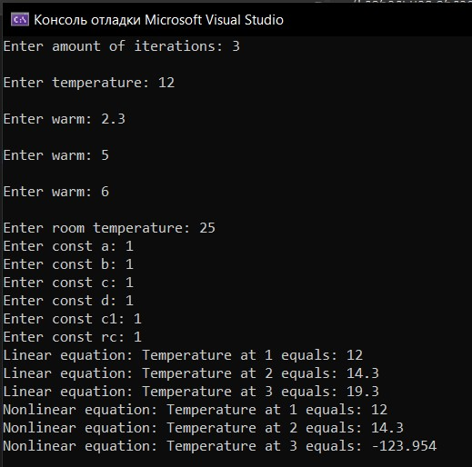
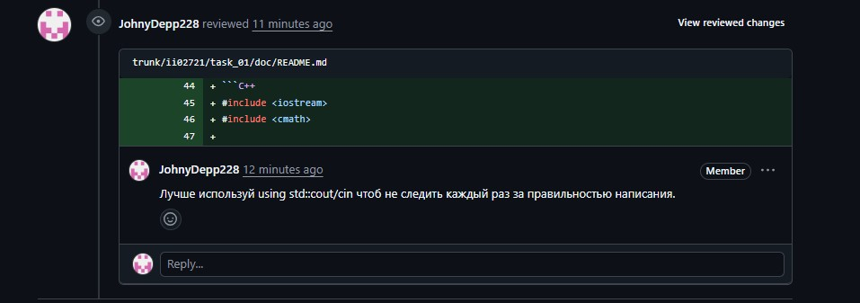

 Министерство образования Республики Беларусь

Учреждение образования

“Брестский Государственный технический университет”

Кафедра ИИТ

       

Лабораторная работа №1

По дисциплине “Общая теория интеллектуальных систем”

Тема: “Моделирования температуры объекта”

     

Выполнил:

Студент 2 курса

Группы ИИ-27

Масюк А.Д.

Проверил:

Дворанинович Д.А.

     

Брест 2025

# Общее задание #
1. Написать отчет по выполненной лабораторной работе №1 в .md формате (readme.md) и с помощью запроса на внесение изменений (pull request) разместить его в следующем каталоге: trunk\ii0xxyy\task_01\doc (где xx - номер группы, yy - номер студента, например ii02302).
2. Исходный код написанной программы разместить в каталоге: trunk\ii0xxyy\task_01\src.
3. Выполнить рецензирование ([review](https://linearb.io/blog/code-review-on-github), [checklist](https://linearb.io/blog/code-review-checklist)) запросов других студентов (минимум 2-е рецензии).
4. Отразить выполнение работы в файле readme.md в соответствующей строке (например, для студента под порядковым номером 1 - https://github.com/brstu/OTIS-2023/edit/main/readme.md?#L17-L17).

## Task 1. Modeling controlled object ##
Let's get some object to be controlled. We want to control its temperature, which can be described by this differential equation:

$$\Large\frac{dy(\tau)}{d\tau}=\frac{u(\tau)}{C}+\frac{Y_0-y(\tau)}{RC} $$ (1)

where $\tau$ – time; $y(\tau)$ – input temperature; $u(\tau)$ – input warm; $Y_0$ – room temperature; $C,RC$ – some constants.

After transformation we get these linear (2) and nonlinear (3) models:

$$\Large y_{\tau+1}=ay_{\tau}+bu_{\tau}$$ (2)
$$\Large y_{\tau+1}=ay_{\tau}-by_{\tau-1}^2+cu_{\tau}+d\sin(u_{\tau-1})$$ (3)

where $\tau$ – time discrete moments ($1,2,3{\dots}n$); $a,b,c,d$ – some constants.
Task is to write program (С++), which simulates this object temperature.
## Код программы

'''

#include <iostream>
#include <cmath>
#include <vector>
using namespace std;

class Obj {
private:
	int k = 4;
	int t = 0;
	vector<double> y;
	vector<double> u;
	double y0 = 25;
	double temp_change = 0;
	double a = 1;
	double b = 1;
	double c = 1;
	double d = 1;
	double c1 = 1;
	double rc = 1;
public:
	Obj() {
		y.resize(k, 0);
		u.resize(k, 0);
	}
	void input() {
		cout << "Enter amount of iterations: ";
		cin >> this->k;
		u.resize(k, 0);
		y.resize(k, 0);
	    cout << "\nEnter temperature: ";
		cin >> y.at(0);
		for (auto& warm : u) {
			cout << "\nEnter warm: ";
			cin >> warm;
		}
		u.resize(k + 1, 0);
		y.resize(k + 1, 0);
		cout << "\nEnter room temperature: ";

		cin >> this->y0;

		cout << "Enter const a: ";

		cin >> this->a;

		cout << "Enter const b: ";

		cin >> this->b;

		cout << "Enter const c: ";

		cin >> this->c;

		cout << "Enter const d: ";

		cin >> this->d;

		cout << "Enter const c1: ";

		cin >> this->c1;

		cout << "Enter const rc: ";

		cin >> this->rc;

	}
	void equation1(const int& place) {

		this->temp_change = u.at(place) / c + (y0 - y.at(place)) / rc;

	}
	void linear(const int& place) {
		if (place <= k  && place >= 0) {
			this->y.at(place + 1) = a * y.at(place) + b * u.at(place);
		}
		else {
			cout << "\nEntered place out of range";
		}

	}
	void nonlinear(const int& place) {

		if (place > 0 && place <= k) {
			this->y.at(place + 1) = a * y.at(place) - (b * (y.at(place - 1) * y.at(place - 1))) + (c * u.at(place) + d * sin(u.at(place - 1)));
		}
		else {
			cout << "\nEntered place out of range";
		}

	}
	int getN() const {

		return this->k;

	}
	int getT() const {

		return this->t;

	}
	double getY(int place) const {

		return this->y.at(place);

	}
	double getDelt() const {

		return this->temp_change;

	}
};
int main()
{
Obj a;
a.input();
int n = a.getN();
int t = a.getT();
for (int j = t; j < n; j++) {
a.linear(j);
cout << "Linear equation: Temperature at " << j + 1 << " equals: " << a.getY(j) << endl;
a.equation1(j);
cout << "Temperature change at " << j << " is: " << a.getDelt() << endl;
}
t++;
cout << "Nonlinear equation: Temperature at 1" << " equals: " << a.getY(0) << endl;
for (int m = t; m < n; m++) {
a.nonlinear(m);
cout << "Nonlinear equation: Temperature at " << m + 1 << " equals: " << a.getY(m) << endl;
a.equation1(m);
cout << "Temperature change at " << m << " is: " << a.getDelt() << endl;
}	
return 0;
}

'''

## Результат

## Reviews
fedotovd778
 

 
GOOrst
 

