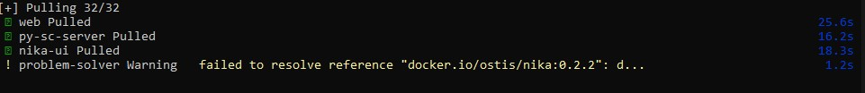
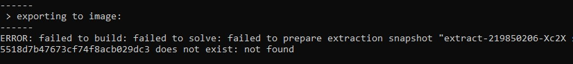
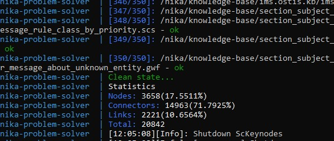
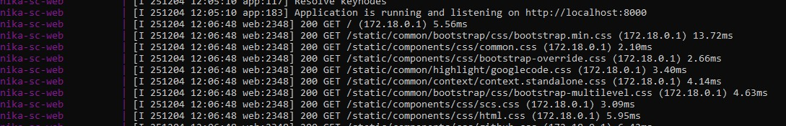
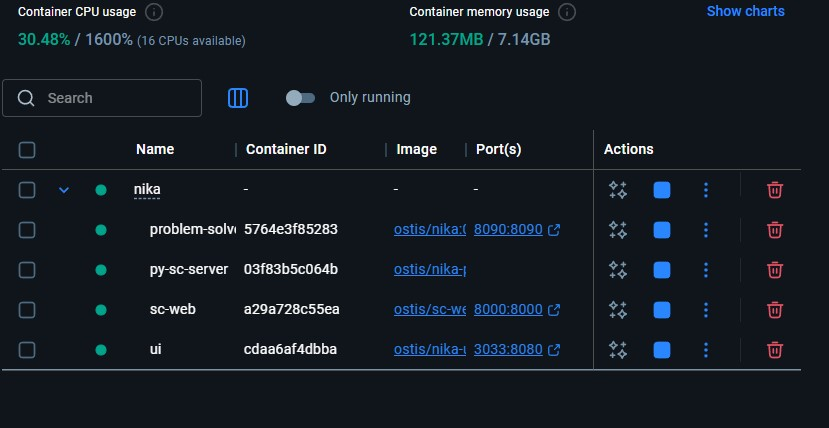
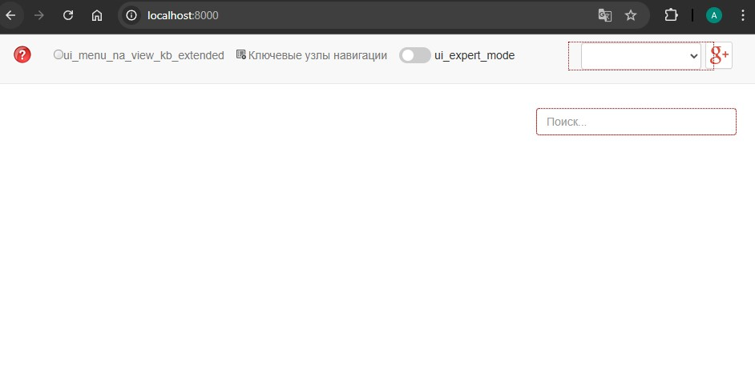
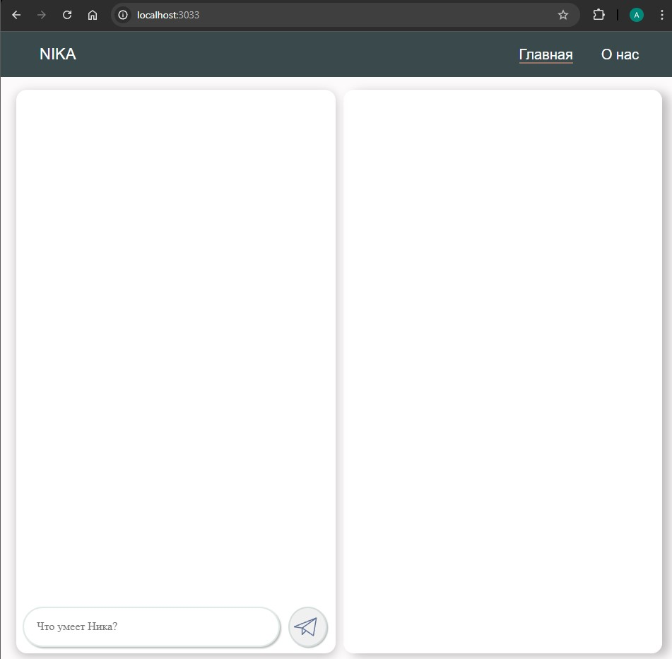

<p align="center">Министерство образования Республики Беларусь</p>
<p align="center">Учреждение образования</p>
<p align="center">“Брестский Государственный технический университет”</p>
<p align="center">Кафедра ИИТ</p>
<br><br><br><br><br><br><br>
<p align="center">Лабораторная работа №4</p>
<p align="center">По дисциплине “Общая теория интеллектуальных систем”</p>
<p align="center">Тема: “Работа с проектом "NIKA" (Intelligent Knowledge-driven Assistant)”</p>
<br><br><br><br><br>
<p align="right">Выполнил:</p>
<p align="right">Студент 2 курса</p>
<p align="right">Группы ИИ-27</p>
<p align="right">Масюк А.Д.</p>
<p align="right">Проверил:</p>
<p align="right">Дворанинович Д.А.</p>
<br><br><br><br><br>
<p align="center">Брест 2025</p>

# Работа с проектом **"NIKA"** (Intelligent Knowledge-driven Assistant) #

1. Изучить [руководство](https://github.com/ostis-apps/nika).

2. Запустить данный проект на локальной машине (домашний персональный компьютер, ноутбук, рабочая машина в аудитории и т.п.). Продемонстрировать работу проекта преподавателю.

3. Написать отчет по выполненной работе в .md формате (readme.md) и с помощью pull request разместить его в следующем каталоге: trunk\ii0xxyy\task_04\doc.

# BEFORE READING & INSTALLING
Для запуска проекта NIKA в данной лабораторной работе использую `Windows 10 22H2`.

# Ход работы 

## Введение
Данная лабораторная работа рассчитана на то, чтобы закрепить знания работы с Git, GitHub. Также она позволяет нам 
научиться использовать новые технологии, такую, как Docker, который позволит нам собрать и запустить проект NIKA на нашей
локальной машине, а также уметь применять нестандартные решения.

Данный отчет содержит подробное решение, которое могу предоставить, по запуску проекта NIKA на локальной машине, используя Docker. 

### Этап 1 [ Общая Подготовка ]
В первую очередь перейдем в интересующий нас репозиторий [OSTIS/NIKA](https://github.com/ostis-apps/nika). 
Снизу можно увидеть README.md файл с инструкциями по настройке и запуске проекта NIKA.
<br>

<br>
В данном README.md файле нас интересует, прежде всего, раздел **Requirements**, который говорит нам об первоочередной установке **Docker** на нашу локальную машину. Устанавливаем Docker,
перейдя по предоставленной там ссылке [https://docs.docker.com/](https://docs.docker.com/).
После установки у нас появляется приложение **Docker Desktop**.

## Этап 2 [ Установка NIKA 0.2.2 с GitHub ]
Вводим команды в cmd:
```
git clone -c core.longpaths=true -c core.autocrlf=true https://github.com/ostis-apps/nika
cd nika
git submodule update --init --recursive
docker compose pull
```
После этого вознила проблема связанная с отсутсвием нужной версии файла

Для ее устанения были введены следующий косанды:
```
C:\Users\Boss\Desktop\nika\nika>docker pull ostis/nika:latest
latest: Pulling from ostis/nika
Digest: sha256:fa83aa4df253b0290ef51fd766ae6cf6819a6748ecf9ac003fca01e78d97f47d
Status: Image is up to date for ostis/nika:latest
docker.io/ostis/nika:latest

C:\Users\Boss\Desktop\nika\nika>docker build -t ostis/nika:0.2.2 .
```


Это команды установят последюю версию файла ostis/nika и пересоберет ее с необходимой версией 0.2.2

После этого возникла ошибка связанная с кэшем.

Она была исправлена с помощью:
```
C:\Users\Boss\Desktop\nika\nika>docker builder prune -af
```
Команда очистила неиспользуемые образы Docker.
## Этап 3 [ Запуск NIKA ]	
Во-первых запустим Docker Desktop:
`docker desktop start`

Запустим проект: `docker compose up`<br>
Ожидаем некоторое время, когда в консоли появиться сообщение/текст в конце:
<br>

<br>

<br>
Также в приложении Docker будут следующие контейнеры:
<br>

<br>
После этого, можно открыть браузер и ввести, в зависимости от того, что хочется просмотреть, URL:

### sc-web - `localhost:8000`


### dialogue web UI - `localhost:3033`

