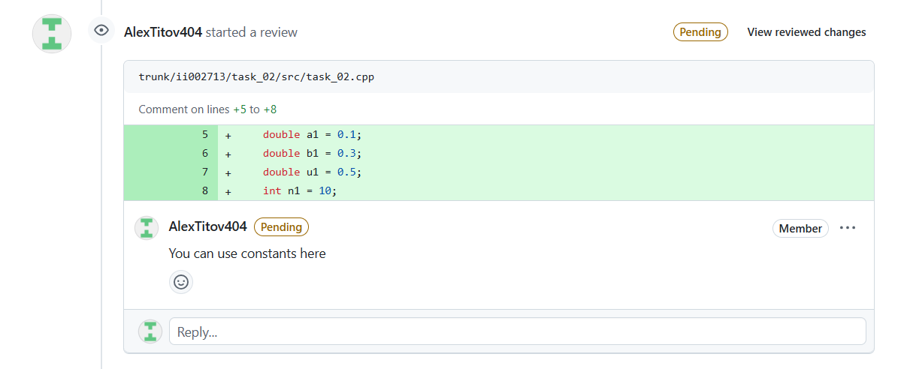
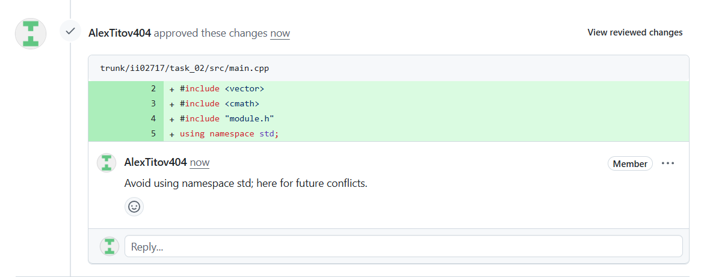

<p align="center"> Министерство образования Республики Беларусь</p>
<p align="center">Учреждение образования</p>
<p align="center">“Брестский Государственный технический университет”</p>
<p align="center">Кафедра ИИТ</p>
<br><br><br><br><br><br><br>
<p align="center">Лабораторная работа №2</p>
<p align="center">По дисциплине “Общая теория интеллектуальных систем”</p>
<p align="center">Тема: “Моделирования температуры объекта”</p>
<br><br><br><br><br>
<p align="right">Выполнил:</p>
<p align="right">Студент 2 курса</p>
<p align="right">Группы ИИ-27</p>
<p align="right">Титунин А.А.</p>
<p align="right">Проверил:</p>
<p align="right">Дворанинович Д.А.</p>
<br><br><br><br><br>
<p align="center">Брест 2025</p>

# Общее задание #
Написать модульные тесты для программы, разработанной в лабораторной работе №1.

1. Использовать следующий фреймворк для модульного тестирования - [Google Test](https://google.github.io/googletest/).
2. Написать модульные тесты для основных функций программы. Разместить тесты в каталоге: **trunk\ii0xxyy\task_02\test**.
3. Исходный код модифицированной программы разместить в каталоге: **trunk\ii0xxyy\task_02\src**.
4. В файле `readme.md` отразить количество написанных тестов и процент покрытия кода тестами (использовать любой инструмент для анализа покрытия, например, [gcovr](https://gcovr.com/en/stable/)).
5. Также необходимо отразить выполнение работы в общем файле [`readme.md`](https://github.com/brstu/OTIS-2025/blob/main/README.md) в соответствующей строке (например, для студента под порядковым номером 1 - https://github.com/brstu/OTIS-2025/blob/b2d60c2765b369aed21af76af8fa4461da2c8da6/README.md?plain=1#L13).


## Код тестов:
```C++
#include <gtest/gtest.h>
#include <cmath>
#include "../src/functions.h"

TEST(LinearTest, CalculatesCorrectly) {
    const int steps = 3;
    double y[steps], u[steps];
    y[0] = 10.0;
    u[0] = 5.0;

    linear(1.0, 0.5, y, u, steps);

    EXPECT_DOUBLE_EQ(y[1], 1.0 * 10.0 + 0.5 * 5.0); // 12.5
    EXPECT_DOUBLE_EQ(u[1], 5.0 * 0.8);              // 4.0
    EXPECT_DOUBLE_EQ(y[2], 1.0 * 12.5 + 0.5 * 4.0); // 14.5
    EXPECT_DOUBLE_EQ(u[2], 4.0 * 0.8);              // 3.2
}

TEST(NonLinearTest, CalculatesCorrectly) {
    const int steps = 4;
    double y[steps], u[steps];
    y[0] = 10.0;
    y[1] = 12.0;
    u[0] = 5.0;
    u[1] = u[0] * 0.8;

    nonLinear(1.0, 0.5, 0.2, 0.1, y, u, steps);

    double expected_y2 = 1.0 * 12.0 - 0.5 * 10.0 / 2.0 + 0.2 * u[1] + 0.1 * sin(u[0]);
    EXPECT_NEAR(y[2], expected_y2, 1e-6);

    double expected_u2 = u[1] * 0.8;
    EXPECT_NEAR(u[2], expected_u2, 1e-6);
}
```

## Результат googletest:
Running main() from D:\Project\OTIS-2025\trunk\ii02719\task_02\test\build\_deps\googletest-src\googletest\src\gtest_main.cc
[==========] Running 2 tests from 2 test suites.
[----------] Global test environment set-up.
[----------] 1 test from LinearTest
[ RUN      ] LinearTest.CalculatesCorrectly
y[1] = 12.5
y[2] = 14.5
[       OK ] LinearTest.CalculatesCorrectly (0 ms)
[----------] 1 test from LinearTest (1 ms total)

[----------] 1 test from NonLinearTest
[ RUN      ] NonLinearTest.CalculatesCorrectly
y[1] = 12
y[2] = 10.2041
[       OK ] NonLinearTest.CalculatesCorrectly (0 ms)
[----------] 1 test from NonLinearTest (4 ms total)

[----------] Global test environment tear-down
[==========] 2 tests from 2 test suites ran. (10 ms total)
[  PASSED  ] 2 tests.

## Результат gcovr:
(INFO) Reading coverage data...
(INFO) Writing coverage report...
------------------------------------------------------------------------------
                           GCC Code Coverage Report
Directory: .
------------------------------------------------------------------------------
File                                       Lines    Exec  Cover   Missing
------------------------------------------------------------------------------
src/functions.cpp                             12      12   100%
test/test.cpp                                 28      28   100%
------------------------------------------------------------------------------
TOTAL                                         40      40   100%
------------------------------------------------------------------------------

## Reviews
topg1616
<br>

<br>
igor7123
<br>
