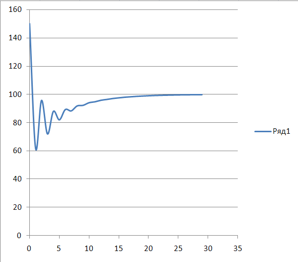

<p align="center"> Министерство образования Республики Беларусь</p>
<p align="center">Учреждение образования</p>
<p align="center">“Брестский Государственный технический университет”</p>
<p align="center">Кафедра ИИТ</p>
<br><br><br><br><br><br><br>
<p align="center">Лабораторная работа №3</p>
<p align="center">По дисциплине “Общая теория интеллектуальных систем”</p>
<p align="center">Тема: “ПИД-регуляторы”</p>
<br><br><br><br><br>
<p align="right">Выполнил:</p>
<p align="right">Студент 2 курса</p>
<p align="right">Группы ИИ-27</p>
<p align="right">Титунин А.А.</p>
<p align="right">Проверил:</p>
<p align="right">Дворанинович Д.А.</p>
<br><br><br><br><br>
<p align="center">Брест 2025</p>

# Общее задание #
На C++ реализовать программу, моделирующую рассмотренный выше ПИД-регулятор. В качестве объекта управления использовать математическую модель, полученную в предыдущей работе. В отчете также привести графики для разных заданий температуры объекта, пояснить полученные результаты.

1. Написать отчет по выполненной лабораторной работе No3 в .md формате (readme.md) и разместить его в следующем каталоге: trunk\ii0xxyy\task_03\doc.
2. Исходный код написанной программы разместить в каталоге: trunk\ii0xxyy\task_03\src.
3. Отразить выполнение работы в файле readme.md в соответствующей строке (например, для студента под порядковым номером 1 - https://github.com/brstu/OTIS-2025/edit/main/readme.md?#L17-L17).
4. Документировать исходный код программы с помощью комментариев в стиле Doxygen. Полученную документацию разместить в каталоге: trunk\ii0xxyy\task_03\doc\html. Настроить для автоматической публикации документации из этого каталога.GitHub Pages
5. Разработанная программа также должна быть покрыта модульными тестами, написанными с использованием Google Test. Тесты разместить в каталоге: trunk\ii0xxyy\task_03\test.

## Код программы:
```C++
#include "functions.h"
#include <iostream>
#include <cmath>
#include <vector>

/**
 * @brief Главная функция программы.
 *
 * Выполняет расчет по линейной модели температуры объекта.
 * Пользователь вводит начальное значение температуры, после чего вызывается функция linear
 * для моделирования изменения температуры на заданном количестве шагов.
 *
 * @return int Код завершения программы (0 — успешное завершение).
 */
int main()
{
	setlocale(LC_ALL, "Russian");
	/// Количество шагов моделирования
	const int steps = 30;
	/// Вектор значений температуры на каждом шаге
	std::vector<double> y;
	y.resize(steps);
	/// Коэффициент линейной модели (первый параметр)
	double a = 0.8;
	/// Коэффициент линейной модели (второй параметр)
	double b = 0.5;

	std::cout << "Рассчет по линейной модели\n";
	std::cout << "Введите начальную температуру объекта y(0): ";
	std::cin >> y[0];

	/**
	 * @brief Вызывает функцию линейной модели.
	 *
	 * Функция linear должна быть определена в "functions.h" и моделировать изменение температуры.
	 *
	 * @param a Первый коэффициент модели
	 * @param b Второй коэффициент модели
	 * @param y Вектор значений температуры
	 * @param steps Количество шагов моделирования
	 */
    linear(a, b, y, steps);

	std::cout << "Нажмите Enter для выхода...";
	std::cin.ignore();
	std::cin.get();
}
```
## функции:
```C++
#include "functions.h"
#include <iostream>
#include <cmath>
#include <vector>

void linear(double a, double b, std::vector<double>& y, const int steps)
{
	double target = 100;
	double u;
	double P = 1.6;
	double I = 0.32;
	double D = 0.4;
	double e = 0;
	double e0;
	double sumE = 0;
	double dE;

	for (int i = 1; i < steps; i++)
	{
		e0 = e;
		e = target - y[i - 1];
		sumE += e;
		dE = e - e0;
		u = P * e + I * sumE + D * dE;
		y[i] = a * y[i - 1] + b * u;
		std::cout << "y[" << i << "] = " << y[i] << std::endl;
	}
}
```

## Код тестов:
```C++
#include <gtest/gtest.h>
#include <cmath>
#include "../src/functions.h"

TEST(LinearTest, CalculatesCorrectly) {
    const int steps = 3;
    std::vector<double> y;
	y.resize(steps);
    double a = 0.8;
    double b = 0.5;
    y[0] = 10.0;

    linear(a, b, y, steps);

    EXPECT_DOUBLE_EQ(y[1], 0.8 * 10.0 + 0.5 * (1.6 * 90.0 + 0.32 * 90.0 + 0.4 * 90.0)); // 112,4
    EXPECT_DOUBLE_EQ(y[2], 0.8 * 112.4 + 0.5 * (1.6 * -12.4 + 0.32 * 77.6 + 0.4 * -102.4)); // 71,936
}
```

## Результат googletest:
Running main() from D:\Project\OTIS-2025\trunk\ii02719\task_03\test\build\_deps\googletest-src\googletest\src\gtest_main.cc
[==========] Running 1 test from 1 test suite.
[----------] Global test environment set-up.
[----------] 1 test from LinearTest
[ RUN      ] LinearTest.CalculatesCorrectly
y[1] = 112.4
y[2] = 71.936
[       OK ] LinearTest.CalculatesCorrectly (1 ms)
[----------] 1 test from LinearTest (2 ms total)

[----------] Global test environment tear-down
[==========] 1 test from 1 test suite ran. (6 ms total)
[  PASSED  ] 1 test.


## Reviews
topg1616
<br>

<br>
igor7123
<br>
