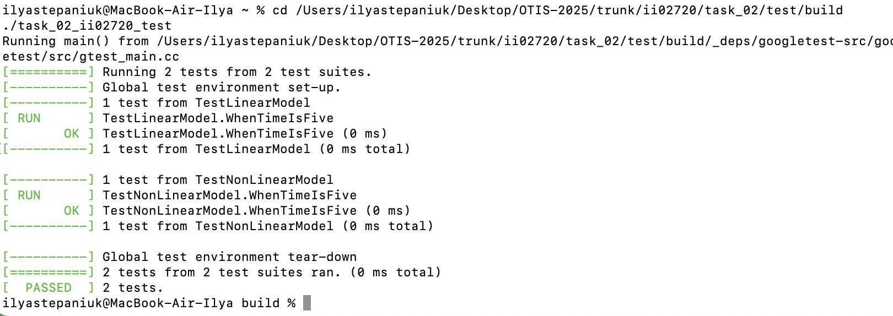
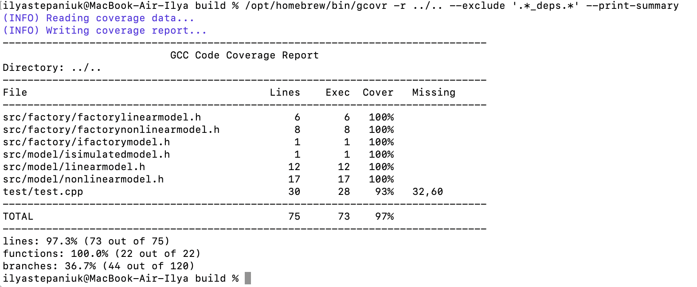

Министерство образования Республики Беларусь

Учреждение образования

"Брестский Государственный технический университет"

Кафедра ИИТ

       

Лабораторная работа №2

По дисциплине "Общая теория интеллектуальных систем"

Тема: "Модульное тестирование. Покрытие исходного кода тестами."

     

Выполнил:

Студент 2 курса

Группы ИИ-27

Степанюк И.С.

Проверил:

Иванюк Д.С.

     

Брест 2025

## Общее задание
Написать модульные тесты для программы, разработанной в лабораторной работе №1.

1. Использовать фреймворк [Google Test](https://google.github.io/googletest/)
2. Тесты размещены в каталоге: **trunk\ii02720\task_02\test**
3. Исходный код в каталоге: **trunk\ii02720\task_02\src**

## Результаты тестирования

## Покрытие кода

