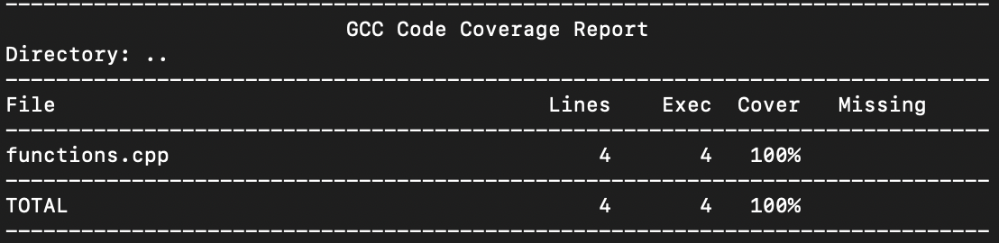

<p align="center">Министерство образования Республики Беларусь</p>
<p align="center">Учреждение образования</p>
<p align="center">“Брестский Государственный технический университет”</p>
<p align="center">Кафедра ИИТ</p>
<br><br><br><br><br><br><br>
<p align="center">Лабораторная работа №2</p>
<p align="center">По дисциплине “Общая теория интеллектуальных систем”</p>
<p align="center">Тема: “Модульное тестирование. Покрытие исходного кода тестами.”</p>
<br><br><br><br><br>
<p align="right">Выполнил:</p>
<p align="right">Студент 2 курса</p>
<p align="right">Группы ИИ-28</p>
<p align="right">Вабищевич И.В.</p>
<p align="right">Проверил:</p>
<p align="right">Дворанинович Д.А.</p>
<br><br><br><br><br>
<p align="center">Брест 2025</p>

---

# Общее задание
Написать модульные тесты для программы, разработанной в лабораторной работе №1.

1. Использовать фреймворк для модульного тестирования — [Google Test](https://google.github.io/googletest/).  
2. Написать модульные тесты для основных функций программы. Разместить тесты в каталоге: **trunk/ii02803/task_02/test**.  
3. Исходный код модифицированной программы разместить в каталоге: **trunk/ii02803/task_02/src**.  
4. В файле `readme.md` отразить количество написанных тестов и процент покрытия кода тестами (например, с помощью [gcovr](https://gcovr.com/en/stable/)).  
5. Также необходимо отразить выполнение работы в общем [`readme.md`](https://github.com/brstu/OTIS-2025/blob/main/README.md) в соответствующей строке.

---

# Код юнит-тестов [ test/test.cpp ]

```cpp

#include <gtest/gtest.h>
#include <cmath>
#include "functions.h" 

// ------------------------
// Тесты для линейной модели
// ------------------------
TEST(LinearModelTest, BaseCase) {
    EXPECT_NEAR(linear(0.25, 0.45, 0.6, 0.1), 0.6*0.25 + 0.1*0.45, 1e-6); // 0.15 + 0.045 = 0.195
}

TEST(LinearModelTest, WithNonZeroY) {
    EXPECT_NEAR(linear(0.35, 0.55, 1.5, 0.8), 1.5*0.35 + 0.8*0.55, 1e-6); // 0.525 + 0.44 = 0.965
}

// ------------------------
// Тесты для нелинейной модели
// ------------------------
TEST(NonlinearModelTest, BaseCase) {
    double result = non_linear(0.2, 0.1, 0.8, 0.6, 0.15, 0.2); // y, u, a, b, c, d
    double expected = 0.8*0.2 - 0.6*0.2*0.2 + 0.15*0.1 + 0.2*std::sin(0.1);
    EXPECT_NEAR(result, expected, 1e-6);
}

TEST(NonlinearModelTest, WithValues) {
    double result = non_linear(0.6, 0.4, 0.4, 0.3, 0.25, 0.15);
    double expected = 0.4*0.6 - 0.3*0.6*0.6 + 0.25*0.4 + 0.15*std::sin(0.4);
    EXPECT_NEAR(result, expected, 1e-6);
}

```
## Результаты юнит-тестирования (GoogleTest)


## Покрытие тестами (gcovr)


