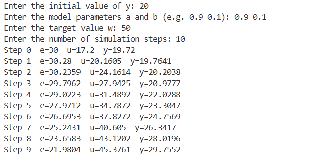
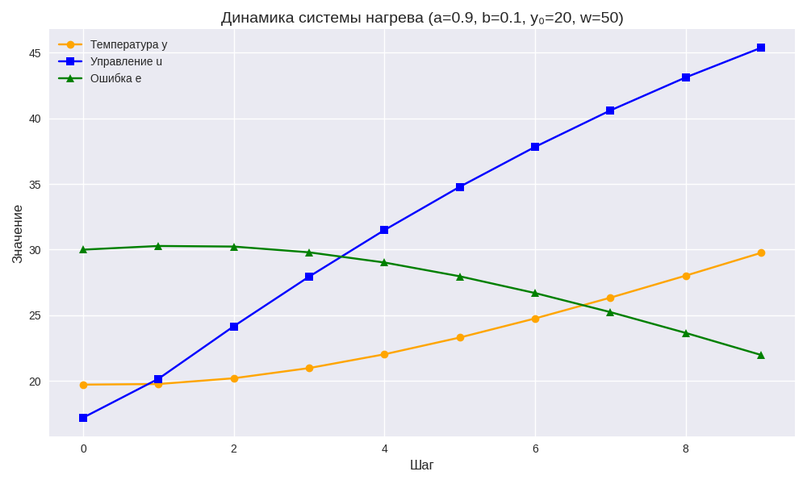

<p align="center"> Министерство образования Республики Беларусь</p>
<p align="center">Учреждение образования</p>
<p align="center">“Брестский Государственный технический университет”</p>
<p align="center">Кафедра ИИТ</p>
<br><br><br><br><br><br><br>
<p align="center">Лабораторная работа №3</p>
<p align="center">По дисциплине “Общая теория интеллектуальных систем”</p>
<p align="center">Тема: “ПИД-регуляторы”</p>
<br><br><br><br><br>
<p align="right">Выполнил:</p>
<p align="right">Студент 2 курса</p>
<p align="right">Группы ИИ-28</p>
<p align="right">Деркач Е.В.</p>
<p align="right">Проверил:</p>
<p align="right">Дворанинович Д.А.</p>
<br><br><br><br><br>
<p align="center">Брест 2025</p>

<hr> 


# Общее задание #
Написать модульные тесты для программы, разработанной в лабораторной работе №1.

1. Написать отчет по выполненной лабораторной работе №3 в .md формате (readme.md) и разместить его в следующем каталоге: trunk\ii0xxyy\task_03\doc.
2. Исходный код написанной программы разместить в каталоге: trunk\ii0xxyy\task_03\src.
3. Отразить выполнение работы в файле readme.md в соответствующей строке (например, для студента под порядковым номером 1 - https://github.com/brstu/OTIS-2025/edit/main/readme.md?#L17-L17).
4. Документировать исходный код программы с помощью комментариев в стиле Doxygen. Полученную документацию разместить в каталоге: trunk\ii0xxyy\task_03\doc\html. Настроить GitHub Pages для автоматической публикации документации из этого каталога.
5. Разработанная программа также должна быть покрыта модульными тестами, написанными с использованием Google Test. Тесты разместить в каталоге: trunk\ii0xxyy\task_03\test.
 
# Код программы:  
lab3.cpp
``` 
#include <iostream>
#include "pid.h"
#include "model.h"

using namespace std;

/**
 * @brief Main program for PID controller simulation.
 *
 * The program asks the user to enter:
 * - Initial system state y0
 * - Model parameters a and b
 * - Target value w
 * - Number of simulation steps
 *
 * Then it simulates the system controlled by a PID regulator.
 */
int main() {
    double y0, a, b;
    cout << "Enter the initial value of y: ";
    cin >> y0;

    cout << "Enter the model parameters a and b (e.g. 0.9 0.1): ";
    cin >> a >> b;

    double w;
    cout << "Enter the target value w: ";
    cin >> w;

    int steps;
    cout << "Enter the number of simulation steps: ";
    cin >> steps;

    /// PID controller parameters
    double K  = 0.4;
    double T  = 3.0;
    double Td = 0.1;
    double T0 = 1.0;

    PID pid(K, T, Td, T0);
    double y = y0;

    for (int k = 0; k < steps; k++) {
        double e = w - y;          ///< Error signal
        double u = pid.compute(e); ///< Control signal
        y = linear(y, u, a, b);    ///< System update

        cout << "Step " << k
             << "  e=" << e
             << "  u=" << u
             << "  y=" << y << endl;
    }

    return 0;
} 

```    
model.cpp
```
#include "model.h"

/**
 * @brief Linear system update.
 *
 * Computes the next state of the system:
 * y_next = a * y + b * u
 *
 * @param y current state
 * @param u control signal
 * @param a model coefficient
 * @param b model coefficient
 * @return next state
 */
double linear(double y, double u, double a, double b) {
    return a * y + b * u;
} 
double nonlinear(double a, double b, double c, double d, double u, double y) {
    return a * u + b * y + c * std::sin(y) - d * y * y;
}

```
model.h
```
#pragma once
#include <cmath>

/**
 * @brief Linear system model.
 *
 * Computes the next state of the system:
 * y_next = a * y + b * u
 */
double linear(double y, double u, double a, double b);

/**
 * @brief Nonlinear system model.
 *
 * Computes the next state of the system:
 * y_next = a * y + b * u + c * sin(y) - d * y^2
 */
double nonlinear(double a, double b, double c, double d, double u, double y);

```
pid.cpp
```
#include "pid.h"

/**
 * @brief Constructor implementation for PID controller.
 */
PID::PID(double K, double T, double Td, double T0)
    : K(K), T(T), Td(Td), T0(T0), integral(0.0), prevError(0.0) {}

/**
 * @brief Compute control signal using PID formula.
 *
 * u = K * ( e + (T0/T) * integral + (Td/T0) * derivative )
 *
 * @param e current error
 * @return control signal u
 */
double PID::compute(double e) {
    // Integral term
    integral += e * T0;

    // Derivative term
    double derivative = (e - prevError) / T0;

    // PID output
    double u = K * (e + (integral / T) + (Td * derivative));

    prevError = e;
    return u;
}

```
pid.h
```
#pragma once

/**
 * @brief PID controller class.
 *
 * Implements a simple PID controller with parameters:
 * - K: proportional gain
 * - T: integral time
 * - Td: derivative time
 * - T0: sampling period
 */
class PID {
private:
    double K;   ///< Proportional gain
    double T;   ///< Integral time
    double Td;  ///< Derivative time
    double T0;  ///< Sampling period

    double integral;   ///< Integral accumulator
    double prevError;  ///< Previous error for derivative

public:
    /**
     * @brief Constructor for PID controller.
     * @param K proportional gain
     * @param T integral time
     * @param Td derivative time
     * @param T0 sampling period
     */
    PID(double K, double T, double Td, double T0);

    /**
     * @brief Compute control signal.
     * @param e current error
     * @return control signal u
     */
    double compute(double e);
};

```

test.cpp
```
#include <gtest/gtest.h>
#include "model.h"
#include "pid.h" 

constexpr double PI = 3.14159265358979323846;

TEST(ModelTest, LinearZeroParams) {
    double y_next = linear(5.0, 3.0, 0.0, 0.0);
    EXPECT_DOUBLE_EQ(y_next, 0.0);
}

TEST(ModelTest, LinearBasic) {
    double y_next = linear(2.0, 4.0, 1.0, 2.0);
    EXPECT_DOUBLE_EQ(y_next, 2.0*1.0 + 4.0*2.0); // 10.0
}

TEST(ModelTest, NonlinearWithoutControlTerms) {
    double y_next = nonlinear(0.0, 2.0, 0.0, 1.0, 0.0, 2.0);
    EXPECT_DOUBLE_EQ(y_next, 4.0 - 4.0); // 0.0
}


TEST(ModelTest, NonlinearWithSin) {
    double y_next = nonlinear(0.0, 0.0, 1.0, 0.0, 0.0, PI / 2);
    EXPECT_NEAR(y_next, 1.0, 1e-9); // sin(pi/2) = 1
}


TEST(PIDTest, ZeroError) {
    PID pid(1.0, 1.0, 0.0, 1.0);
    double u = pid.compute(0.0);
    EXPECT_DOUBLE_EQ(u, 0.0);
}

TEST(PIDTest, ConstantError) {
    PID pid(2.0, 1.0, 0.0, 1.0);
    double u1 = pid.compute(1.0);
    double u2 = pid.compute(1.0);
    EXPECT_NE(u1, u2); 
}
```


Запуск собранной программы:


Результаты тестов:


График динамики системы нагрева (a=0.9, b=0.1, y₀=20, w=50): 

