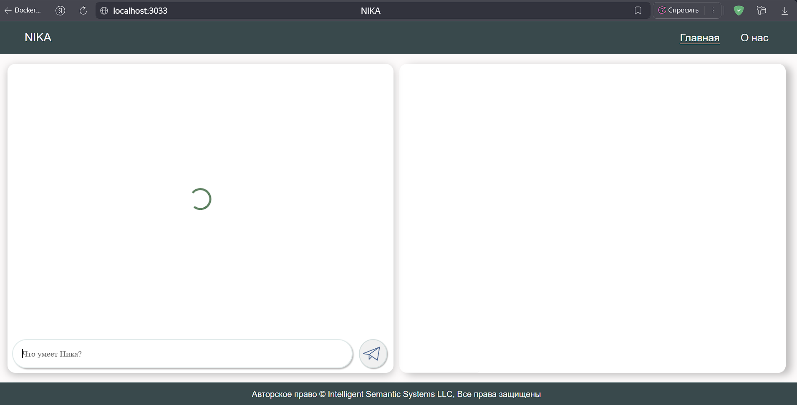

<p align="center">Министерство образования Республики Беларусь</p>
<p align="center">Учреждение образования</p>
<p align="center">“Брестский Государственный технический университет”</p>
<p align="center">Кафедра ИИТ</p>
<br><br><br><br><br><br><br>
<p align="center">Лабораторная работа №4</p>
<p align="center">По дисциплине “Общая теория интеллектуальных систем”</p>
<p align="center">Тема: “Работа с проектом "NIKA" (Intelligent Knowledge-driven Assistant)”</p>
<br><br><br><br><br>
<p align="right">Выполнил:</p>
<p align="right">Студент 2 курса</p>
<p align="right">Группы ИИ-28</p>
<p align="right">Жукович Е.Д.</p>
<p align="right">Проверил:</p>
<p align="right">Дворанинович Д.А.</p>
<br><br><br><br><br>
<p align="center">Брест 2025</p>

# Работа с проектом **"NIKA"** (Intelligent Knowledge-driven Assistant) #

1. Изучить [руководство](https://github.com/ostis-apps/nika).

2. Запустить данный проект на локальной машине. Продемонстрировать работу проекта преподавателю.

3. Написать отчет по выполненной работе в .md формате (readme.md) и с помощью pull request разместить его в следующем каталоге: trunk\ii0xxyy\task_04\doc.

# Условия выполнения
Для запуска проекта NIKA в данной лабораторной работе использую `Windows 10 22H2`.

# Ход работы 

### Этап 1 [ Подготовка ]
Перейдем в интересующий нас репозиторий [OSTIS/NIKA](https://github.com/ostis-apps/nika). 
Снизу можно увидеть README.md файл с инструкциями по настройке и запуске проекта NIKA.

В данном README.md файле нас интересует, прежде всего, раздел **Requirements**, который говорит нам об первоочередной установке **Docker**. Устанавливаем Docker,
перейдя по предоставленной там ссылке [https://docs.docker.com/](https://docs.docker.com/).
После установки у нас появляется приложение **Docker Desktop**.
При первом запуске данной программы появилось окно, которое требовало установки **WSL**:
<br>

<br>
Эту проблему решаем вводом в консоль(cmd) командой: `wsl --install`
<br>

<br>
Перезагружаемся.

Перед вводом команд в терминал, нужно сделать следующие вещи:

 1)Открыть реестр (`Win + R` и написать `regedit`) <br>
 2)Перейти по пути `HKEY_LOCAL_MACHINE\SYSTEM\CurrentControlSet\Control\FileSystem`
 3)Найти параметр `LongPathsEnabled` и установить значение на 1.
<br>

<br>
  - Запустить cmd
  - Ввести команду: `git config --system core.longpaths true` либо `git config --global core.longpaths true`
 Перезагружаемся.

## Этап 2 [ Установка NIKA]
Вводим команды в cmd:
```
git clone -c core.longpaths=true -c core.autocrlf=true https://github.com/ostis-apps/nika
cd nika
git submodule update --init --recursive
```
Однако, в момент выполнения лабораторной не хватает контейнера ostis/nika:0.2.0 на DockerHub.
Значит нам остается перейти на предыдущую версию (0.1.0).
Для этого введем команду:
```
git checkout 69858165c3b5fb26ca783950c74bfe7bddd64a00
```
<br>

<br>

Теперь запустим проект на локальной машине.
 
## Этап 3 [ Запуск NIKA ]	
Во-первых запустим Docker Desktop:
`docker desktop start`

Получим контейнеры с **DockerHub**:
<br>
 `docker compose pull`
<br>
После выполненной команды получились следующие контейнеры:
<br>

<br>
Запустим проект: `docker compose up --no-build`
<br>
Ожидаем некоторое время, когда в консоли появиться сообщение/текст в конце:
<br>

<br>
После этого, можно открыть NIKA:

Наша NIKA - `localhost:3033`
