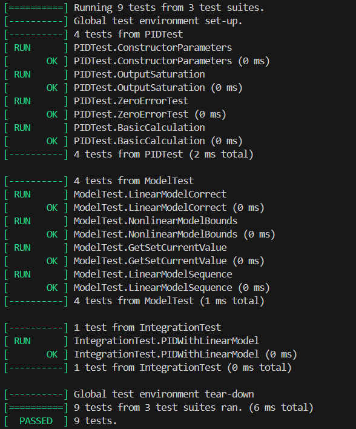

<p align="center"> Министерство образования Республики Беларусь</p>
<p align="center">Учреждение образования</p>
<p align="center">“Брестский Государственный технический университет”</p>
<p align="center">Кафедра ИИТ</p>
<br><br><br><br><br><br><br>
<p align="center">Лабораторная работа №3</p>
<p align="center">По дисциплине “Общая теория интеллектуальных систем”</p>
<p align="center">Тема: “Моделирование системы автоматического управления с ПИД-регулятором для объекта теплового класса.”</p>
<br><br><br><br><br>
<p align="right">Выполнил:</p>
<p align="right">Студент 2 курса</p>
<p align="right">Группы ИИ-28</p>
<p align="right">Климахович К.В.</p>
<p align="right">Проверил:</p>
<p align="right">Иванюк Д.С.</p>
<br><br><br><br><br>
<p align="center">Брест 2025</p>

# Общее задание #
1. Написать отчет по выполненной лабораторной работе №3 в .md формате (*readme.md*) и разместить его в следующем каталоге: **trunk\ii0xxyy\task_03\doc**.
2. Исходный код написанной программы разместить в каталоге: **trunk\ii0xxyy\task_03\src**.
3. Отразить выполнение работы в файле readme.md в соответствующей строке (например, для студента под порядковым номером 1 - https://github.com/brstu/OTIS-2025/edit/main/readme.md?#L17-L17).
4. Документировать исходный код программы с помощью комментариев в стиле **Doxygen**. Полученную документацию разместить в каталоге: **trunk\ii0xxyy\task_03\doc\html**. Настроить `GitHub Pages` для автоматической публикации документации из этого каталога.
5. Разработанная программа также должна быть покрыта модульными тестами, написанными с использованием **Google Test**. Тесты разместить в каталоге: **trunk\ii0xxyy\task_03\test**.

## main.cpp ##
```cpp
/**
 * @file main.cpp
 * @brief Основная программа тестирования ПИД-регулятора
 * @author Константин
 * @date 2025
 */

#include <iostream>
#include <fstream>
#include <iomanip>
#include "pid.h"
#include "model.h"

/**
 * @brief Главная функция программы
 * @return 0 при успешном выполнении
 */
int main() {
    setlocale(LC_ALL,"ru");
    std::cout << "PID Controller - Variant 11\n";
    std::cout << "==========================\n\n";
    
    // Тест 1: Линейная модель
    std::cout << "\n=== TEST 1: Linear Model ===\n";
    
    /**
     * @brief Тест линейной модели
     * @details Создаётся линейная модель с коэффициентами (0.2, 0.3, 0.4, 0.5)
     *          и ПИД-регулятор с параметрами (K=0.8, Ti=2.0, Td=0.5, T0=1.0).
     *          Симуляция 50 шагов с заданием 30°C.
     */
    Model model_lin(0.2, 0.3, 0.4, 0.5);
    model_lin.init(20.0, 21.0, 0.0, 0.0);
    
    PID pid_lin(0.8, 2.0, 0.5, 1.0);
    
    std::ofstream file_lin("results_linear.csv");
    file_lin << "Step,Setpoint,Temperature,Control\n";
    
    const double linear_setpoint = 30.0;
    
    for (int i = 0; i < 50; i++) {
        double temp = model_lin.getCurrentValue();
        double control = pid_lin.calculate(linear_setpoint, temp);
        model_lin.linearModel(control);
        
        file_lin << i << "," << linear_setpoint << "," << temp << "," << control << "\n";
        
        if (i % 10 == 0) {
            std::cout << "Step " << i << ": T=" << temp 
                      << "°C, U=" << control << "%\n";
        }
    }
    
    file_lin.close();
    
    std::cout << "\n=== TEST 2: Nonlinear Model ===\n";
    
    /**
     * @brief Тест нелинейной модели
     * @details Создаётся нелинейная модель с коэффициентами (0.2, 0.15, 0.4, 0.5)
     *          и ПИД-регулятор с параметрами (K=0.3, Ti=5.0, Td=0.2, T0=1.0).
     *          Задание плавно изменяется от 21°C до 40°C за 20 шагов.
     *          Симуляция 150 шагов.
     */
    Model model_nl(0.2, 0.15, 0.4, 0.5);
    double y0 = 21.0;
    model_nl.init(y0, y0, 0.0, 0.0);
    
    PID pid_nl(0.3, 5.0, 0.2, 1.0);
    pid_nl.reset();
    
    std::ofstream file_nl("results_nonlinear.csv");
    file_nl << "Step,Setpoint,Temperature,Control\n";
    
    const double setpoint_start = y0;
    const double setpoint_final = 40.0;
    const int ramp_steps = 20;
    const double U_MAX = 100.0;
    
    for (int i = 0; i < 150; i++) {
        double current_setpoint = (i < ramp_steps)
            ? setpoint_start + (setpoint_final - setpoint_start) * i / ramp_steps
            : setpoint_final;
        
        double temp = model_nl.getCurrentValue();
        double control = pid_nl.calculate(current_setpoint, temp);
        
        if (control > U_MAX) control = U_MAX;
        if (control < 0.0)   control = 0.0;
        
        model_nl.nonlinearModel(control);
        file_nl << i << "," << current_setpoint << "," << temp << "," << control << "\n";
    }
    
    file_nl.close();
    
    std::cout << "\n==========================\n";
    std::cout << "Results saved:\n";
    std::cout << "- Linear model: results_linear.csv\n";
    std::cout << "- Nonlinear model: results_nonlinear.csv\n";
    
    return 0;
}
```
## model.cpp ##
```cpp
#include "model.h"
#include <cmath>
#include <iostream>

/**
 * @brief Конструктор модели
 */
Model::Model(double a_val, double b_val, double c_val, double d_val)
    : a(a_val), b(b_val), c(c_val), d(d_val),
      y_prev1(0.0), y_prev2(0.0), u_prev1(0.0), u_prev2(0.0) {}

/**
 * @brief Инициализация начальных условий
 */
void Model::init(double y0, double y1, double u0, double u1) {
    y_prev2 = y0;
    y_prev1 = y1;
    u_prev2 = u0;
    u_prev1 = u1;
}

/**
 * @brief Линейная модель объекта
 */
double Model::linearModel(double u) {
    u_prev2 = u_prev1;
    u_prev1 = u;
    
    double y = a * y_prev1 + b * u;
    
    y_prev2 = y_prev1;
    y_prev1 = y;
    
    return y;
}

/**
 * @brief Нелинейная модель объекта
 */
double Model::nonlinearModel(double u) {
    u_prev2 = u_prev1;
    u_prev1 = u;

    double y2 = y_prev2;
    double smooth_quad = y2 * std::tanh(y2);
    
    double y = a * y_prev1
               - b * smooth_quad
               + c * u
               + d * std::sin(u_prev1);

    if (y > 1000.0) y = 1000.0;
    if (y < -1000.0) y = -1000.0;
    if (std::isnan(y)) y = 0.0;

    y_prev2 = y_prev1;
    y_prev1 = y;

    return y;
}
```
## pid.cpp ##
```cpp
#include "pid.h"
#include <iostream>
#include <vector>
#include <cmath>

/**
 * @brief Конструктор ПИД-регулятора
 */
PID::PID(double K_val, double Ti_val, double Td_val, double T0_val)
    : K(K_val), Ti(Ti_val), Td(Td_val), T0(T0_val),
      e_prev1(0.0), e_prev2(0.0), u_prev(0.0),
      integral(0.0), d_prev(0.0) {
    
    if (T0 <= 0) T0 = 1.0;
    if (Ti <= 0) Ti = 1.0;
    
    q0 = K * (1.0 + Td / T0);
    q1 = -K * (1.0 + 2.0 * Td / T0 - T0 / Ti);
    q2 = K * Td / T0;
}

/**
 * @brief Вычисление управляющего воздействия
 */
double PID::calculate(double setpoint, double current_value) {
    double error = setpoint - current_value;
    double delta_u = q0 * error + q1 * e_prev1 + q2 * e_prev2;
    double u = u_prev + delta_u;
    
    if (u > 100.0) u = 100.0;
    if (u < 0.0) u = 0.0;
    
    e_prev2 = e_prev1;
    e_prev1 = error;
    u_prev = u;
    
    return u;
}

/**
 * @brief Сброс состояния регулятора
 */
void PID::reset() {
    e_prev1 = 0.0;
    e_prev2 = 0.0;
    u_prev = 0.0;
    integral = 0.0;
    d_prev = 0.0;
}

/**
 * @brief Получение коэффициентов рекуррентного алгоритма
 */
std::vector<double> PID::getCoefficients() const {
    return std::vector<double>{q0, q1, q2};
}

/**
 * @brief Получение параметров ПИД-регулятора
 */
void PID::getParameters(double& K_param, double& Ti_param, double& Td_param) const {
    K_param = K;
    Ti_param = Ti;
    Td_param = Td;
}
```
## model.h ##
```cpp
#ifndef MODEL_H
#define MODEL_H

/**
 * @class Model
 * @brief Модель объекта управления
 */
class Model {
private:
    double a;        
    double b;         
    double c;        
    double d;        
    
    double y_prev1;  
    double y_prev2;  
    double u_prev1;  
    double u_prev2;  
    
public:
    /**
     * @brief Конструктор модели
     * @param a_val Коэффициент a (по умолчанию 0.2)
     * @param b_val Коэффициент b (по умолчанию 0.3)
     * @param c_val Коэффициент c (по умолчанию 0.4)
     * @param d_val Коэффициент d (по умолчанию 0.5)
     */
    explicit Model(double a_val = 0.2, double b_val = 0.3, 
                   double c_val = 0.4, double d_val = 0.5);
    
    /**
     * @brief Инициализация начальных условий
     * @param y0 Начальное значение y[k-2]
     * @param y1 Начальное значение y[k-1]
     * @param u0 Начальное значение u[k-2]
     * @param u1 Начальное значение u[k-1]
     */
    void init(double y0, double y1, double u0, double u1);
    
    /**
     * @brief Линейная модель объекта
     * @param u Текущее управляющее воздействие
     * @return Текущее значение выхода
     */
    double linearModel(double u);
    
    /**
     * @brief Нелинейная модель объекта
     * @param u Текущее управляющее воздействие
     * @return Текущее значение выхода
     * @warning Включает ограничение выходных значений ±1000
     */
    double nonlinearModel(double u);
    
    /**
     * @brief Получение текущего значения выхода
     * @return Текущее значение y[k-1]
     */
    double getCurrentValue() const { return y_prev1; }
    
    /**
     * @brief Установка текущего значения выхода
     * @param value Новое значение
     */
    void setCurrentValue(double value) { y_prev1 = value; }
};

#endif
```
## pid.h ##
```cpp
#ifndef PID_H
#define PID_H

#include <vector>

/**
 * @class PID
 * @brief Цифровой ПИД-регулятор
 */
class PID {
private:
    double K;        
    double Ti;       
    double Td;       
    double T0;       

    double q0;       
    double q1;       
    double q2;       

    double e_prev1;  
    double e_prev2;  
    double u_prev;   

    double integral; 
    double d_prev;   

public:
    /**
     * @brief Конструктор ПИД-регулятора
     * @param K_val Коэффициент усиления
     * @param Ti_val Постоянная времени интегрирования
     * @param Td_val Постоянная времени дифференцирования
     * @param T0_val Период дискретизации (по умолчанию 1.0)
     */
    PID(double K_val, double Ti_val, double Td_val, double T0_val = 1.0);

    /**
     * @brief Вычисление управляющего воздействия
     * @param setpoint Заданное значение
     * @param current_value Текущее значение процесса
     * @return Управляющее воздействие u[k] (ограниченное 0-100%)
     */
    double calculate(double setpoint, double current_value);

    /**
     * @brief Сброс состояния регулятора
     */
    void reset();

    /**
     * @brief Получение коэффициентов рекуррентного алгоритма
     * @return Вектор коэффициентов [q0, q1, q2]
     */
    std::vector<double> getCoefficients() const;

    /**
     * @brief Получение параметров ПИД-регулятора
     * @param[out] K_param Коэффициент усиления
     * @param[out] Ti_param Постоянная времени интегрирования
     * @param[out] Td_param Постоянная времени дифференцирования
     */
    void getParameters(double& K_param, double& Ti_param, double& Td_param) const;
};

#endif
```
## test.cpp ##
```cpp
#include <gtest/gtest.h>
#include "pid.h"
#include "model.h"
#include <cmath>

TEST(PIDTest, ConstructorParameters) {
    PID pid(1.0, 2.0, 0.5, 1.0);
    double K, Ti, Td;
    pid.getParameters(K, Ti, Td);
    EXPECT_DOUBLE_EQ(K, 1.0);
    EXPECT_DOUBLE_EQ(Ti, 2.0);
    EXPECT_DOUBLE_EQ(Td, 0.5);
}

TEST(PIDTest, OutputSaturation) {
    PID pid(100.0, 0.1, 10.0, 1.0);
    double u = pid.calculate(1000.0, 0.0);
    EXPECT_GE(u, 0.0);
    EXPECT_LE(u, 100.0);
}

TEST(PIDTest, ZeroErrorTest) {
    PID pid(1.0, 1.0, 0.1, 1.0);
    pid.reset();
    double control1 = pid.calculate(10.0, 10.0);
    EXPECT_DOUBLE_EQ(control1, 0.0);
    double control2 = pid.calculate(10.0, 10.0);
    EXPECT_DOUBLE_EQ(control2, 0.0);
}

TEST(PIDTest, BasicCalculation) {
    PID pid(0.5, 1.0, 0.1, 0.1);
    pid.reset();
    double control = pid.calculate(10.0, 5.0);
    EXPECT_GT(control, 0.0);
    EXPECT_LE(control, 100.0);
}

TEST(ModelTest, LinearModelCorrect) {
    Model model(0.2, 0.3, 0.0, 0.0);
    model.init(10.0, 10.0, 0.0, 0.0);
    double y = model.linearModel(10.0);
    double expected = 0.2 * 10.0 + 0.3 * 10.0;
    EXPECT_NEAR(y, expected, 1e-6);
}

TEST(ModelTest, NonlinearModelBounds) {
    Model model(10.0, 10.0, 10.0, 10.0);
    model.init(0.0, 0.0, 0.0, 0.0);
    double y = model.nonlinearModel(1000.0);
    EXPECT_LE(y, 1000.0);
    EXPECT_GE(y, -1000.0);
}

TEST(ModelTest, GetSetCurrentValue) {
    Model model(0.2, 0.3, 0.4, 0.5);
    model.init(10.0, 20.0, 0.0, 0.0);
    EXPECT_DOUBLE_EQ(model.getCurrentValue(), 20.0);
    model.setCurrentValue(30.0);
    EXPECT_DOUBLE_EQ(model.getCurrentValue(), 30.0);
}

TEST(ModelTest, LinearModelSequence) {
    Model model(0.8, 0.2, 0.0, 0.0);
    model.init(0.0, 0.0, 0.0, 0.0);
    
    std::vector<double> outputs;
    for (int i = 0; i < 5; i++) {
        outputs.push_back(model.linearModel(1.0));
    }
    
    for (size_t i = 1; i < outputs.size(); i++) {
        EXPECT_GT(outputs[i], outputs[i-1]);
    }
}

TEST(IntegrationTest, PIDWithLinearModel) {
    Model model(0.7, 0.3, 0.0, 0.0);
    model.init(20.0, 20.0, 0.0, 0.0);
    
    PID pid(0.5, 2.0, 0.1, 1.0);
    
    const double setpoint = 30.0;
    double final_temp = 0.0;
    
    for (int i = 0; i < 50; i++) {
        double temp = model.getCurrentValue();
        double control = pid.calculate(setpoint, temp);
        if (control > 100.0) control = 100.0;
        if (control < 0.0) control = 0.0;
        model.linearModel(control);
        final_temp = temp;
    }
    
    EXPECT_GT(final_temp, 20.0);
    EXPECT_LT(std::abs(final_temp - setpoint), 10.0);
}

int main(int argc, char **argv) {
    ::testing::InitGoogleTest(&argc, argv);
    return RUN_ALL_TESTS();
}
```
## Результаты тестирования ##


## Page ##
