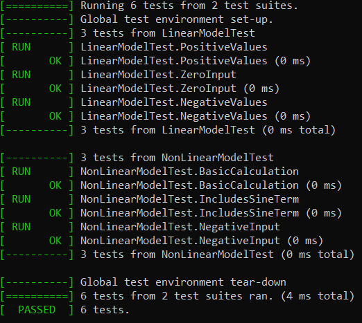

<p align="center"> Министерство образования Республики Беларусь</p>
<p align="center">Учреждение образования</p>
<p align="center">“Брестский Государственный технический университет”</p>
<p align="center">Кафедра ИИТ</p>
<br><br><br><br><br><br><br>
<p align="center">Лабораторная работа №2</p>
<p align="center">по дисциплине “Общая теория интеллектуальных систем”</p>
<p align="center">Тема: “Модульное тестирование. Покрытие исходного кода тестами”</p>
<br><br><br><br><br>
<p align="right">Выполнил:</p>
<p align="right">Студент 2 курса</p>
<p align="right">Группы ИИ-28</p>
<p align="right">Клименко М.С.</p>
<p align="right">Проверил:</p>
<p align="right">Дворанинович Д.А.</p>
<br><br><br><br><br>
<p align="center">Брест 2025</p>

<hr>


# Общее задание #
Написать модульные тесты для программы, разработанной в лабораторной работе №1.

1. Использовать следующий фреймворк для модульного тестирования - [Google Test](https://google.github.io/googletest/).
2. Написать модульные тесты для основных функций программы. Разместить тесты в каталоге: **trunk\ii0xxyy\task_02\test**.
3. Исходный код модифицированной программы разместить в каталоге: **trunk\ii0xxyy\task_02\src**.
4. В файле `readme.md` отразить количество написанных тестов и процент покрытия кода тестами (использовать любой инструмент для анализа покрытия, например, [gcovr](https://gcovr.com/en/stable/)).
5. Также необходимо отразить выполнение работы в общем файле [`readme.md`](https://github.com/brstu/OTIS-2025/blob/main/README.md) в соответствующей строке (например, для студента под порядковым номером 1 - https://github.com/brstu/OTIS-2025/blob/b2d60c2765b369aed21af76af8fa4461da2c8da6/README.md?plain=1#L13).
## Код модульных тестов ##
```
#define _USE_MATH_DEFINES
#include <gtest/gtest.h>
#include "../src/functions.h"

TEST(LinearModelTest, PositiveValues) {
    EXPECT_DOUBLE_EQ(linear_model(2.0, 3.0, 1.0, 4.0), 2.0 * 1.0 + 3.0 * 4.0);
}

TEST(LinearModelTest, ZeroInput) {
    EXPECT_DOUBLE_EQ(linear_model(1.5, 2.0, 0.0, 0.0), 0.0);
}

TEST(LinearModelTest, NegativeValues) {
    EXPECT_DOUBLE_EQ(linear_model(-1.0, 2.0, 3.0, -4.0), -1.0 * 3.0 + 2.0 * -4.0);
}

TEST(NonLinearModelTest, BasicCalculation) {
    double res = nonlinear_model(1.0, 1.0, 1.0, 0.0, 2.0, 3.0, 1.0, 0.0);
    EXPECT_NEAR(res, 1.0 * 3.0 - 1.0 * 4.0 + 1.0 * 1.0 + 0.0, 1e-9);
}

TEST(NonLinearModelTest, IncludesSineTerm) {
    double res1 = nonlinear_model(1.0, 0.0, 0.0, 1.0, 0.0, 1.0, 0.0, M_PI / 2);
    EXPECT_NEAR(res1, 1.0 * 1.0 - 0.0 * 0.0 + 0.0 * 0.0 + 1.0 * sin(M_PI / 2), 1e-9);
}

TEST(NonLinearModelTest, NegativeInput) {
    double res = nonlinear_model(-1.0, 1.0, 2.0, -1.0, 1.0, -2.0, 3.0, M_PI);
    double expected = -1.0 * -2.0 - 1.0 * 1.0 + 2.0 * 3.0 - 1.0 * sin(M_PI);
    EXPECT_NEAR(res, expected, 1e-9);
}

```
## Результаты тестирования ##

## Покрытие тестами (GCC Code Coverage) ##

