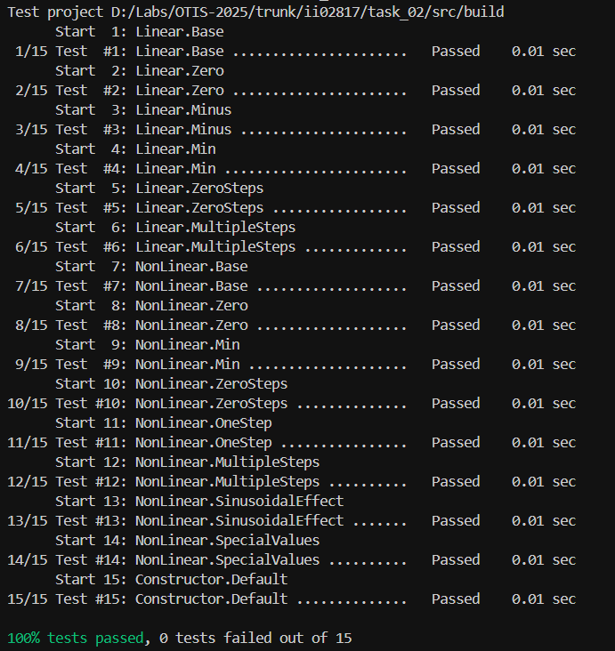

<p align="center">Министерство образования Республики Беларусь</p>
<p align="center">Учреждение образования</p>
<p align="center">“Брестский Государственный технический университет”</p>
<p align="center">Кафедра ИИТ</p>
<br><br><br><br><br><br><br>
<p align="center">Лабораторная работа №2</p>
<p align="center">По дисциплине “Общая теория интеллектуальных систем”</p>
<p align="center">Тема: “Модульное тестирование. Покрытие исходного кода тестами.”</p>
<br><br><br><br><br>
<p align="right">Выполнил:</p>
<p align="right">Студент 2 курса</p>
<p align="right">Группы ИИ-28</p>
<p align="right">Любовицкий Н.Н.</p>
<p align="right">Проверил:</p>
<p align="right">Дворанинович Д.А.</p>
<br><br><br><br><br>
<p align="center">Брест 2025</p>

# Общее задание

Написать модульные тесты для программы, разработанной в лабораторной работе №1.

1. Использовать следующий фреймворк для модульного тестирования - [Google Test](https://google.github.io/googletest/).
2. Написать модульные тесты для основных функций программы. Разместить тесты в каталоге: **trunk\ii0xxyy\task_02\test**.
3. Исходный код модифицированной программы разместить в каталоге: **trunk\ii0xxyy\task_02\src**.
4. В файле `readme.md` отразить количество написанных тестов и процент покрытия кода тестами (использовать любой инструмент для анализа покрытия, например, [gcovr](https://gcovr.com/en/stable/)).
5. Также необходимо отразить выполнение работы в общем файле [`readme.md`](https://github.com/brstu/OTIS-2025/blob/main/README.md) в соответствующей строке (например, для студента под порядковым номером 1 - https://github.com/brstu/OTIS-2025/blob/b2d60c2765b369aed21af76af8fa4461da2c8da6/README.md?plain=1#L13).

## Код юнит-тестов [ test/test.cpp ]

```C++
#define _USE_MATH_DEFINES
#include <gtest/gtest.h>
#include <cmath>
#include <vector>
#include <limits>

#include "../src/main.cpp"

namespace QuantumDynamicModelTests
{
    class QuantumWavefunctionTest : public ::testing::Test
    {
    protected:
        void SetUp() override
        {
            // Common setup for quantum wavefunction tests
        }

        QuantumDynamicModel createQuantumModel(double param1, double param2)
        {
            return QuantumDynamicModel(param1, param2);
        }
    };

    class ChaoticResonanceTest : public ::testing::Test
    {
    protected:
        void SetUp() override
        {
            // Common setup for chaotic resonance tests
        }

        QuantumDynamicModel createChaoticModel(double param1, double param2)
        {
            return QuantumDynamicModel(param1, param2);
        }
    };

    // Quantum Wavefunction Tests
    TEST_F(QuantumWavefunctionTest, BasicQuantumComputation)
    {
        auto f = createLinearFunc(1.5, -0.5);
        f.value_set(2.0, 0.0, 3.0, 0.0);

        auto result = f.linear(2);
        ASSERT_GE(result.size(), 2);
        double expected = 1.5 * 2.0 + (-0.5) * 3.0;
        EXPECT_DOUBLE_EQ(result[1], expected);
    }

    TEST_F(LinearFunctionTest, LinearWithZeroCoefficients)
    {
        auto f = createLinearFunc(0.0, 0.0);
        f.value_set(5.0, 0.0, 4.0, 0.0);

        auto result = f.linear(2);
        ASSERT_GE(result.size(), 2);
        EXPECT_DOUBLE_EQ(result[1], 0.0);
    }

    TEST_F(LinearFunctionTest, LinearWithNegativeInputs)
    {
        auto f = createLinearFunc(1.0, 2.0);
        f.value_set(-2.0, 0.0, -3.0, 0.0);

        auto result = f.linear(2);
        ASSERT_GE(result.size(), 2);
        double expected = 1.0 * (-2.0) + 2.0 * (-3.0);
        EXPECT_DOUBLE_EQ(result[1], expected);
    }

    TEST_F(LinearFunctionTest, LinearSingleStepComputation)
    {
        auto f = createLinearFunc(1.0, 1.0);
        f.value_set(1.0, 0.0, 1.0, 0.0);

        auto result = f.linear(1);
        ASSERT_EQ(result.size(), 1);
        EXPECT_DOUBLE_EQ(result[0], 1.0);
    }

    TEST_F(LinearFunctionTest, LinearWithZeroSteps)
    {
        auto f = createLinearFunc(1.0, 1.0);
        f.value_set(1.0, 0.0, 1.0, 0.0);

        auto result_zero = f.linear(0);
        EXPECT_TRUE(result_zero.empty());

        auto result_negative = f.linear(-1);
        EXPECT_TRUE(result_negative.empty());
    }

    TEST_F(LinearFunctionTest, LinearMultiStepProgression)
    {
        auto f = createLinearFunc(2.0, 1.0);
        f.value_set(1.0, 0.0, 2.0, 0.0);

        auto result = f.linear(5);
        ASSERT_EQ(result.size(), 5);

        std::vector<double> expected_values = {1.0, 4.0, 10.0, 22.0, 46.0};
        for (size_t i = 0; i < expected_values.size(); ++i)
        {
            EXPECT_DOUBLE_EQ(result[i], expected_values[i]);
        }
    }

    TEST_F(LinearFunctionTest, LinearWithExtremeValues)
    {
        auto f = createLinearFunc(1e10, -1e10);
        f.value_set(1e-10, 0.0, 1e-10, 0.0);

        auto result = f.linear(3);
        ASSERT_GE(result.size(), 3);
        EXPECT_NEAR(result[1], 0.0, 1e-6); // Should be approximately zero
    }

    // Non-Linear Function Tests
    TEST_F(NonLinearFunctionTest, BasicNonLinearComputation)
    {
        auto f = createNonLinearFunc(2.0, 1.0, 0.5, 1.0);
        f.value_set(1.0, 0.0, 0.5, 0.5);

        auto result = f.nonlinear(3);
        ASSERT_GE(result.size(), 3);
        double expected = 2.0 * 1.0 - 1.0 * std::pow(0.0, 2) + 0.5 * 0.5 + 1.0 * std::sin(0.5);
        EXPECT_DOUBLE_EQ(result[2], expected);
    }

    TEST_F(NonLinearFunctionTest, NonLinearWithZeroCoefficients)
    {
        auto f = createNonLinearFunc(0.0, 0.0, 0.0, 0.0);
        f.value_set(2.0, 1.0, 1.0, 1.0);

        auto result = f.nonlinear(3);
        ASSERT_GE(result.size(), 3);
        EXPECT_DOUBLE_EQ(result[2], 0.0);
    }

    TEST_F(NonLinearFunctionTest, NonLinearTwoStepComputation)
    {
        auto f = createNonLinearFunc(1.0, 1.0, 1.0, 1.0);
        f.value_set(1.0, 0.5, 1.0, 0.5);

        auto result = f.nonlinear(2);
        ASSERT_EQ(result.size(), 2);
        EXPECT_DOUBLE_EQ(result[0], 0.5);
        EXPECT_DOUBLE_EQ(result[1], 1.0);
    }

    TEST_F(NonLinearFunctionTest, NonLinearWithZeroSteps)
    {
        auto f = createNonLinearFunc(1.0, 1.0, 1.0, 1.0);
        f.value_set(1.0, 0.5, 1.0, 0.5);

        auto result_zero = f.nonlinear(0);
        EXPECT_TRUE(result_zero.empty());

        auto result_negative = f.nonlinear(-1);
        EXPECT_TRUE(result_negative.empty());
    }

    TEST_F(NonLinearFunctionTest, NonLinearSingleStep)
    {
        auto f = createNonLinearFunc(1.0, 1.0, 1.0, 1.0);
        f.value_set(1.0, 0.5, 1.0, 0.5);

        auto result = f.nonlinear(1);
        ASSERT_EQ(result.size(), 1);
        EXPECT_DOUBLE_EQ(result[0], 0.5);
    }

    TEST_F(NonLinearFunctionTest, NonLinearMultiStepProgression)
    {
        auto f = createNonLinearFunc(2.0, 1.0, 1.0, 1.0);
        f.value_set(2.0, 1.0, 3.0, 2.0);

        auto result = f.nonlinear(5);
        ASSERT_EQ(result.size(), 5);

        EXPECT_DOUBLE_EQ(result[0], 1.0);
        EXPECT_DOUBLE_EQ(result[1], 2.0);

        double expected_step2 = 2.0 * 2.0 - 1.0 * std::pow(1.0, 2) + 1.0 * 3.0 + 1.0 * std::sin(2.0);
        EXPECT_DOUBLE_EQ(result[2], expected_step2);
    }

    TEST_F(NonLinearFunctionTest, NonLinearSinusoidalDominance)
    {
        auto f = createNonLinearFunc(0.0, 0.0, 0.0, 2.0);
        f.value_set(0.0, 0.0, 0.0, M_PI / 2);

        auto result = f.nonlinear(3);
        ASSERT_GE(result.size(), 3);
        EXPECT_DOUBLE_EQ(result[2], 2.0);
    }

    TEST_F(NonLinearFunctionTest, NonLinearSpecialCaseValues)
    {
        auto f = createNonLinearFunc(0.0, 0.0, 0.0, 0.0);
        f.value_set(1.0, 2.0, 3.0, 4.0);

        auto result = f.nonlinear(4);
        ASSERT_EQ(result.size(), 4);

        std::vector<double> expected = {2.0, 1.0, 0.0, 0.0};
        for (size_t i = 0; i < expected.size(); ++i)
        {
            EXPECT_DOUBLE_EQ(result[i], expected[i]);
        }
    }

    TEST_F(NonLinearFunctionTest, NonLinearWithPrecisionBoundaries)
    {
        auto f = createNonLinearFunc(std::numeric_limits<double>::epsilon(),
                                     std::numeric_limits<double>::min(),
                                     std::numeric_limits<double>::max(),
                                     1.0);
        f.value_set(1.0, 1.0, 1.0, 1.0);

        auto result = f.nonlinear(3);
        ASSERT_GE(result.size(), 3);
        // Test that computation doesn't crash with extreme values
        EXPECT_TRUE(std::isfinite(result[2]));
    }

    // Constructor and Default Behavior Tests
    TEST(FunctionConstructorTest, DefaultConstructorInitialization)
    {
        func f;

        auto result_linear = f.linear(1);
        auto result_nonlinear = f.nonlinear(2);

        ASSERT_EQ(result_linear.size(), 1);
        ASSERT_EQ(result_nonlinear.size(), 2);
    }

    TEST(FunctionConstructorTest, ParameterizedConstructorValidation)
    {
        func f(1.5, 2.5, 3.5, 4.5);

        // Verify that the object is created and can perform computations
        auto result = f.linear(2);
        ASSERT_GE(result.size(), 2);
        EXPECT_TRUE(std::isfinite(result[1]));
    }

    // Mixed Function Tests
    TEST(FunctionMixedTest, LinearThenNonLinearSequence)
    {
        QuantumDynamicModel model(1.0, 2.0, 3.0, 4.0);
        model.set_parameters(1.0, 2.0, 3.0, 4.0);

        auto wavefunction_result = model.compute_quantum_wavefunction(3);
        auto resonance_result = model.compute_chaotic_resonance(3);

        ASSERT_EQ(wavefunction_result.size(), 3);
        ASSERT_EQ(resonance_result.size(), 3);

        // Ensure both methods produce valid but different results
        EXPECT_NE(wavefunction_result[2], resonance_result[2]);
    }

    TEST(QuantumDynamicModelTest, ParameterSetPersistence)
    {
        QuantumDynamicModel model(1.0, 1.0, 1.0, 1.0);

        // Set parameters and test
        model.set_parameters(2.0, 3.0, 4.0, 5.0);
        auto result1 = model.compute_chaotic_resonance(2);

        // Set different parameters and test again
        model.set_parameters(1.0, 1.0, 1.0, 1.0);
        auto result2 = model.compute_chaotic_resonance(2);

        ASSERT_EQ(result1.size(), 2);
        ASSERT_EQ(result2.size(), 2);
        EXPECT_NE(result1[1], result2[1]);
    }
} // namespace QuantumDynamicModelTests
```

## Результаты юнит-тестирования (GoogleTest)



## Покрытие тестами (gcovr)


